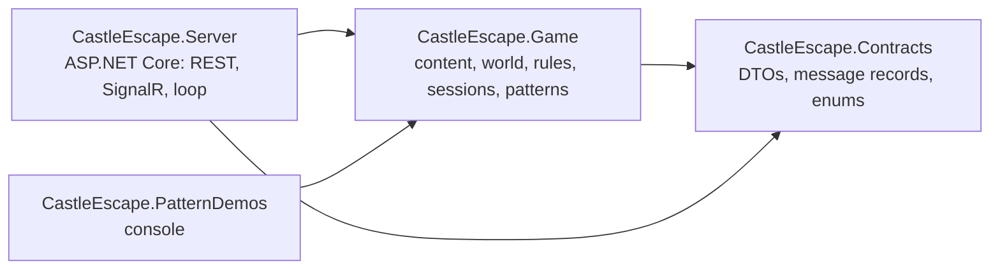
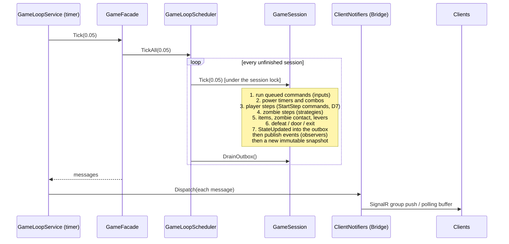

# Architecture

## Projects

- **Contracts** is everything a client sees: request/response records, the realtime messages
  (`IServerMessage`: `SessionId`, `Seq`, `Tick`), enums. It has no logic and could be shared
  with a C# client.
- **Game** has no ASP.NET Core dependency (decision P7). It contains the whole game and every
  pattern, so the console demos and tests can run a real game in-process.
- **Server** is a thin host: dependency injection, configuration, endpoints, the SignalR hub,
  the timer that drives the loop, and the playground page.

## Inside the Game project

| Folder | Contents | Patterns |
|---|---|---|
| `Content/` | JSON content model and `ContentCatalog` (load + validate) | Singleton |
| `World/` | `Grid`, `Tile`, entities, `LevelState`, `PathFinder`, movement and interaction rules, `ExitMechanism` | Prototype (`LevelState`), Factory Method products (`ItemEntity`) |
| `Items/` | item products and `ItemSpawner`s | Factory Method |
| `Generation/` | `LevelDirector`, procedural and preset builders, validator, provider, previewer | Builder |
| `Generation/Themes/` | Dungeon and Crypt factories and their products | Abstract Factory |
| `AI/` | `IZombieMovementStrategy` and the four strategies, `WorldView` | Strategy |
| `Powers/` | `IAbilities` decorators, `PowerManager`, `PowerRules` | Decorator |
| `Commands/` | `IGameCommand`, the commands, `CommandProcessor` | Command |
| `Events/` | `GameEvent` records, `GameEventPublisher`, observers | Observer |
| `Messaging/` | serializer adapters, client notifiers and channels, realtime examples | Adapter, Bridge |
| `Sessions/` | `GameSession`, `GameWorld`, `PlayerMovement`, `SessionRegistry`, `GameLoopScheduler`, `GameFacade`, `DevActions`, `SnapshotMapper` | Facade |
| `Patterns/`, `PatternDemos/` | `[DesignPattern]` attribute, the pattern catalog, one demo per pattern | |

## The tick

The server owns the only copy of the world. A `PeriodicTimer` in `GameLoopService` fires 20 times a
second and calls `GameFacade.Tick`, which goes through `GameLoopScheduler` to every unfinished session:

Movement is tile-based with continuous progress. An entity on a tile may start a step to a
neighbour, then `Progress` runs 0→1 at its speed (tiles/second, from the decorator chain for
players). Arrival on a tile can start the next step in the same tick, so movement is smooth.

## Threading model (decision P10)

- **One lock per session.** Only `Tick` changes the world, under the lock.
- **Inputs are queued, not applied.** Hub and REST threads enqueue commands (`ConcurrentQueue`) with
  a global sequence number; the next tick runs them in order. Two players' inputs are thereby
  ordered fairly, and the world is never touched from a request thread.
- **Lobby calls take the lock briefly** (join, pick character, leave), because they must answer synchronously.
- **Reads never lock.** After each tick the session publishes an immutable `SessionSnapshot`
  (session DTO, last `LevelStarted`, last state, layout, HUD) in a `volatile` field. REST reads and
  hub catch-up use it.
- **Sessions are independent.** A session whose tick throws is stopped with an `Error` message
  (`GameLoopScheduler`); the others continue.

## Request paths

| Client action | Path |
|---|---|
| Create, join, pick character | REST → `GameFacade` → `SessionRegistry` / `GameSession` (locked) |
| Press a key | hub `SetDirection` → `GameFacade.SubmitDirection` → `SetDirectionCommand` queued |
| Read state | REST `/state` → snapshot (JSON or XML through the Adapter) |
| Receive updates | session outbox → Bridge notifiers → SignalR group / polling buffer |
| Reconnect | hub `OnConnectedAsync` → `GameFacade.Connect` → catch-up from the snapshot |

## Levels

`LevelProvider` asks `LevelDirector` (Builder) to build level *n* with a new builder:
`ProceduralLevelBuilder` normally, `PresetLevelBuilder` when `Generation:PresetLevel` is set. The
director picks the theme factory (Abstract Factory), runs the seven steps, validates (GEN-1..3,
LVL-3, D5) and retries with a new seed. Items are placed through spawners (Factory Method). The
session keeps the built level as a prototype and plays on a deep clone; restart is another
clone (Prototype).

## Seams kept for P2

The P1 code leaves single places where each P2 pattern can go in without rewrites. See
[P2_ROADMAP.md](P2_ROADMAP.md): for example, the phase `switch` in `GameSession.Tick` (State),
`MovementRules` and `InteractionResolver` (Chain of Responsibility), `ExitMechanism` (Mediator),
`ILevelProvider` (Proxy), `SnapshotMapper` (Visitor), `Grid`/`Tile` (Flyweight, Iterator).
