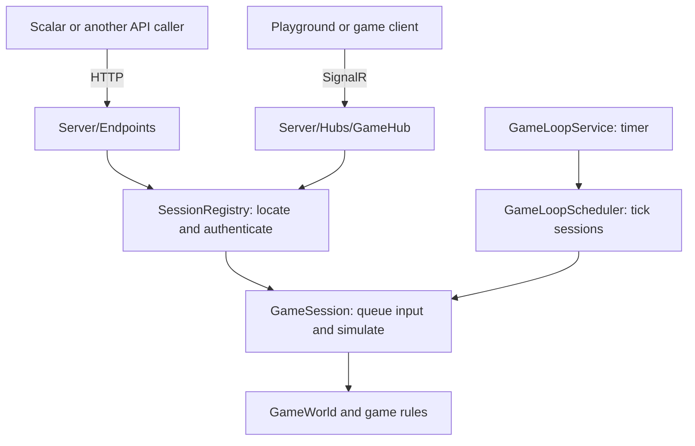

# Understanding the Castle Escape backend

Start at [Program.cs](../src/CastleEscape.Server/Program.cs), then open [GameSession.cs](../src/CastleEscape.Game/Sessions/GameSession.cs) and find `TickPlaying`. The first starts the server; the second shows the gameplay rules in execution order.

## Backend and client boundary

The deliverable is the **game backend**. Two things drive it without a real client: the Scalar API explorer, for sending HTTP requests and inspecting responses, and the [browser playground](../src/CastleEscape.Server/wwwroot/playground) at `/playground`, a developer-only page (`DevTools:Enabled`) that connects over SignalR so you can actually play with the arrow keys. A production game client is still out of scope.

| Location | Responsibility |
|---|---|
| [CastleEscape.Server](../src/CastleEscape.Server) | Accept HTTP/SignalR requests, configure services, run the clock and deliver updates |
| [CastleEscape.Game](../src/CastleEscape.Game) | Own and simulate sessions, levels, players, zombies and game rules |
| [CastleEscape.Contracts](../src/CastleEscape.Contracts) | Define the data crossing the network boundary |
| [playground](../src/CastleEscape.Server/wwwroot/playground) | Developer-only browser page: keyboard input over SignalR, canvas rendering |

The Server and Game projects execute in **one backend process**. The backend decides positions, collisions, damage, powers, score and victory. Requests contain intentions such as “hold Right.” A client communicates using the HTTP endpoints or the `/hubs/game` SignalR connection; the playground does the latter.



## Reading order

1. **[Program.cs](../src/CastleEscape.Server/Program.cs)** — startup. Read the service registrations, `AddHostedService<GameLoopService>()`, `MapScalarApiReference`, endpoint mappings and `MapHub<GameHub>`. `app.Run()` starts the host. ASP.NET Core creates services and supplies them to constructors or endpoint parameters using dependency injection.
2. **[SessionEndpoints.cs](../src/CastleEscape.Server/Endpoints/SessionEndpoints.cs)** — HTTP routes for create, join and character selection. `Create` calls the registry and returns IDs and a player token.
3. **[SessionRegistry.cs](../src/CastleEscape.Game/Sessions/SessionRegistry.cs)** — stores games in a dictionary. `Create` makes a session; `Authenticate` checks the player token. Everything is in memory, so restarting the backend loses sessions.
4. **[GameSession.cs](../src/CastleEscape.Game/Sessions/GameSession.cs)** — one two-player game. Read `SelectCharacter` → `Tick` → `LoadLevel`, then `TickPlaying`. Follow helpers from `TickPlaying` when you want to understand a particular rule.
5. **[GameLoopService.cs](../src/CastleEscape.Server/Realtime/GameLoopService.cs)** — the clock. `ExecuteAsync` calls [GameLoopScheduler.TickAll](../src/CastleEscape.Game/Sessions/GameLoopScheduler.cs) on each timer tick and sends the resulting messages.
6. **[GameplayEndpoints.cs](../src/CastleEscape.Server/Endpoints/GameplayEndpoints.cs)** — input, restart, state, layout, HUD and polling. Read alongside [GameHub.cs](../src/CastleEscape.Server/Hubs/GameHub.cs) to see two network entry points calling the same session methods.

## Starting a game

Starting the backend starts the host and timer. A playable game starts through this sequence:

1. `POST /api/sessions` creates a `GameSession` and the first player in `WaitingForPlayers`.
2. `POST /api/sessions/join` adds the second player using the join code. The phase becomes `CharacterSelect`.
3. Both players choose characters. `GameSession.SelectCharacter` sets `LoadingLevel`.
4. The next tick calls `LoadLevel`. [LevelProvider](../src/CastleEscape.Game/Generation/LevelProvider.cs) selects a builder and [LevelDirector](../src/CastleEscape.Game/Generation/LevelDirector.cs) constructs and validates the map.
5. [GameWorld.BeginLevel](../src/CastleEscape.Game/Sessions/GameWorld.cs) saves the pristine level and starts on a clone. The session changes to `Playing` and queues `LevelStarted`.

No separate start call or SignalR connection is required. You can do all of this through Scalar.

## Trace one movement request

Suppose you send `{"direction":"Right"}` to `POST /api/sessions/{sessionId}/input`.

1. `GameplayEndpoints.SubmitInput` reads the body and `X-Player-Token` header. It calls `SessionRegistry.Authenticate`, then `GameSession.SubmitDirection`.
2. The session adds input data to its queue under a lock. The HTTP response is `202 Accepted`: movement has not necessarily happened yet.
3. The background timer calls `GameLoopScheduler.TickAll`, which calls `GameSession.Tick`. During `Playing`, this runs `TickPlaying`.
4. `ApplyInputs` updates the player's held direction. [PlayerMovement.Move](../src/CastleEscape.Game/Sessions/PlayerMovement.cs) checks [MovementRules.CanPlayerEnter](../src/CastleEscape.Game/World/MovementRules.cs), starts a permitted step and advances the position at the player's calculated speed.
5. The rest of the tick updates zombies, items, contact, levers and end conditions.
6. `SendState` uses [SnapshotMapper](../src/CastleEscape.Game/Sessions/SnapshotMapper.cs) to queue `StateUpdated`. `FlushEvents` notifies observers, and `BuildSnapshot` publishes data for REST reads.
7. The scheduler drains the outgoing messages. `GameLoopService` sends them to SignalR groups and retains them for REST polling. `GET /state` reads the latest snapshot directly.

Send `{"direction":"None"}` to release the direction. The backend remembers a held direction across ticks. A direction request does not mean “move exactly one tile.” The SignalR `SetDirection` method joins the same path at `GameSession.SubmitDirection`.

## What the main objects mean

| Object | Meaning |
|---|---|
| `SessionRegistry` | All games currently held by this backend process |
| `GameSession` | One two-player game, its lobby, phase, input queue and outgoing messages |
| `GameWorld` | Its mutable playing state, restart prototype, checkpoint and events |
| `LevelState` | A map's grid, items, zombies, levers, door and start/exit positions |
| `PlayerSlot` | Joined player identity, token, character selection and connection |
| `PlayerEntity` | Live player position, movement, lives, score and powers |
| `SessionSnapshot` | Latest published data for API readers |
| Contract DTO | A data transfer object: a request, response or message shape |

The tick changes the world under the session lock. Lobby operations and development actions also take that lock. Input requests enqueue data, so input arrival and eventual movement happen on separate execution paths.

## Try it in Scalar

Run from the repository root:

```bash
dotnet run --project src/CastleEscape.Server -- --Generation:PresetLevel=tutorial
```

Open `http://localhost:5035/scalar`. Replace `{sessionId}` with the returned ID.

| Step | Request | Body or action |
|---|---|---|
| 1 | `POST /api/sessions` | `{"playerName":"Ana"}`. Save `sessionId`, `joinCode` and Ana's `playerToken`. |
| 2 | `POST /api/sessions/join` | `{"joinCode":"RETURNED_CODE","playerName":"Ben"}`. Save Ben's token separately. |
| 3 | `PUT /api/sessions/{sessionId}/players/me/character` | Use Ana's token as `X-Player-Token`; body `{"characterId":"scout"}`. |
| 4 | Same character endpoint | Switch to Ben's token; use the same body. |
| 5 | `GET /api/sessions/{sessionId}/state` | After the next tick, inspect `phase`, `tick` and `players`. Retry if loading has not finished. |
| 6 | `POST /api/sessions/{sessionId}/input` | Switch to Ana's token; body `{"direction":"Right"}`. |
| 7 | Same input endpoint | Send `{"direction":"None"}`, then read `/state` again. |

Set breakpoints in `GameplayEndpoints.SubmitInput`, `GameSession.ApplyInputs` and `PlayerMovement.Move`. The first runs during the request; the others run during the background tick. Disable the movement breakpoint after inspecting it because it runs repeatedly.

For manually controlled time, read [GameRulesTests](../tests/CastleEscape.Game.Tests/Sessions/GameRulesTests.cs) and [TestGame](../tests/CastleEscape.Game.Tests/Sessions/TestGame.cs), whose `Tick` helper calls `Session.Tick(0.05)` directly.

## Find a particular rule

| Topic | Source |
|---|---|
| Collision and movement | [MovementRules](../src/CastleEscape.Game/World/MovementRules.cs), [PlayerMovement](../src/CastleEscape.Game/Sessions/PlayerMovement.cs) |
| Item pickup and damage | [InteractionResolver](../src/CastleEscape.Game/World/InteractionResolver.cs) |
| Levers, door and exits | [ExitMechanism](../src/CastleEscape.Game/World/ExitMechanism.cs) |
| Power timers, stacks and speed calculations | [PowerManager](../src/CastleEscape.Game/Powers/PowerManager.cs) |
| Character and item values | [content](../content) |
| The twelve design patterns | [Pattern index](patterns/README.md) |

Continue with [ARCHITECTURE](ARCHITECTURE.md) for project dependencies and threading details.
