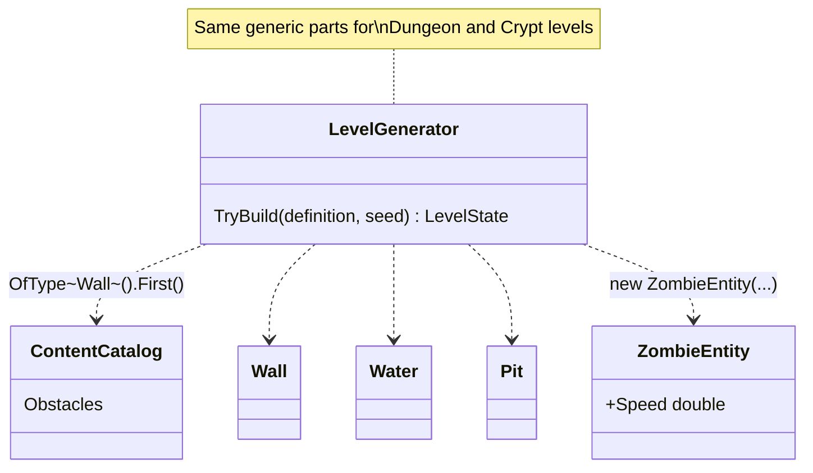
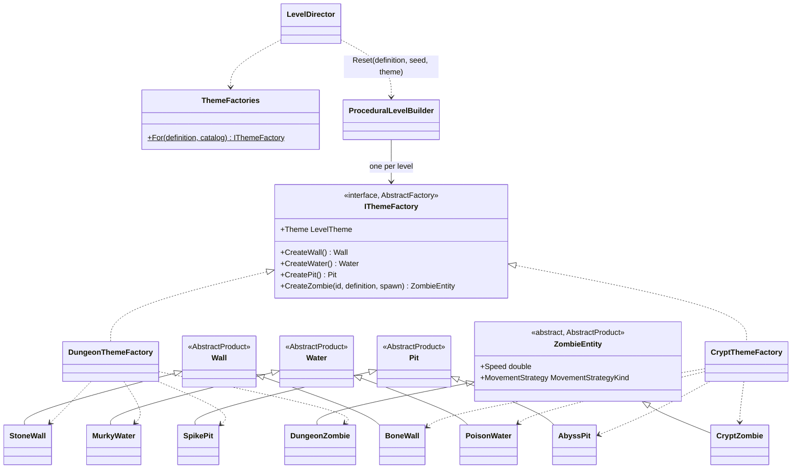

# Abstract Factory — level themes

**Owner:** Student A · **Category:** Creational · **Code:** `src/CastleEscape.Game/Generation/Themes/`
**Demo:** `dotnet run --project src/CastleEscape.PatternDemos -- abstract-factory --theme crypt` · `POST /api/patterns/abstract-factory/demo?theme=dungeon|crypt|both&seed=7`
**Used by:** `ProceduralLevelBuilder` and `PresetLevelBuilder` (one factory per level); `GET /api/sessions/{id}/level` lists the variants used (`obstacles`).

## Problem in this game

Levels 1–5 are Dungeon and 6–10 are Crypt (`content/levels.json`). A theme is more than a colour:
its walls, water, pits and zombies belong together, and the Crypt ones are harder (slower water and
pits, faster zombies that find paths). In the prototype, the generator took the one generic
`wall`, `water` and `pit` from the catalog and `new ZombieEntity(...)`, so levels had no theme at
all. Making each call site pick the themed variant (`if (theme == Crypt) new PoisonWater() else …`)
would spread theme checks everywhere, and one missed check puts a Dungeon pit into a Crypt level.

## Why Abstract Factory

We need a *family* of related products (wall, water, pit, zombie) that must be used together,
with several families (themes). An abstract factory is one object that creates every product of
one family. The generator asks for "a wall", "a zombie", and the factory it was given decides which
family. It picks the factory once per level (`ThemeFactories.For(definition)`), so mixing families
is impossible by construction, not by checking afterwards. Adding a theme means adding one factory
and its products; the generator does not change.

## Participants

| Role | Class |
|---|---|
| AbstractFactory | `IThemeFactory` (`CreateWall`, `CreateWater`, `CreatePit`, `CreateZombie`) |
| ConcreteFactory | `DungeonThemeFactory`, `CryptThemeFactory` |
| AbstractProduct | `Wall`, `Water`, `Pit` (content classes), `ZombieEntity` (now abstract) |
| ConcreteProduct | Dungeon: `StoneWall`, `MurkyWater`, `SpikePit`, `DungeonZombie` · Crypt: `BoneWall`, `PoisonWater`, `AbyssPit`, `CryptZombie` |
| Client | `ProceduralLevelBuilder`, `PresetLevelBuilder` (Builder), which get the factory from `LevelDirector` |

| Product | Dungeon | Crypt |
|---|---|---|
| Wall | `StoneWall` | `BoneWall` |
| Water (speed ×) | `MurkyWater` 0.6 | `PoisonWater` 0.45 |
| Pit (speed ×) | `SpikePit` 1.0 | `AbyssPit` 0.8 |
| Zombie | `DungeonZombie`: type speed, type strategy | `CryptZombie`: speed ×1.2, Greedy upgraded to BFS |

Themed obstacles start from the generic JSON obstacle (`ObstacleTemplates`) through a protected copy
constructor, so rules such as "water needs Swim" and patch sizes stay in `content/obstacles.json` (C7).

## Before (tag `p1-prototype-before-patterns`)



## After



## Key code

```csharp
builder.Reset(definition, seed, ThemeFactories.For(definition, catalog));   // LevelDirector: one family per level

_wall = theme.CreateWall();                                                  // ProceduralLevelBuilder
var obstacle = _theme.CreateObstacle(PickWeighted(_definition.ObstacleTable, ...).Kind);
_level.AddZombie(_theme.CreateZombie(_level.NextEntityId("zombie"), type, spot));
```

```csharp
public sealed class CryptZombie(...) : ZombieEntity(...)   // a product with real behaviour
{
    public override double Speed => Definition.Speed * SpeedBonus;
    public override MovementStrategyKind MovementStrategy =>
        Definition.MovementStrategy == MovementStrategyKind.Greedy ? MovementStrategyKind.Bfs : Definition.MovementStrategy;
}
```

## Requirement: "at least 2 concrete factories, at least 3 classes per family"

2 factories × 4 products (`AbstractFactoryTests.AtLeastTwoConcreteFactories_WithAtLeastThreeProductsEach`,
which also checks that no class is in both families). `GeneratedLevels_NeverMixFamilies` generates all
10 levels with 5 seeds each and checks that every obstacle and zombie comes from that level's factory.
The demo prints both families with their values and reports `mixedParts: 0`.

## Likely live-change requests

| Request | Where to edit |
|---|---|
| "Add a third theme (e.g. Tower)" | `LevelTheme.Tower`; `TowerThemeFactory` and its four products; one case in `ThemeFactories.For`; set `theme` in `content/levels.json`. The generator does not change. |
| "Add a product to every family (e.g. a trap/lava tile)" | New method on `IThemeFactory` and implementations in both factories. This is the pattern's known cost: the compiler lists every factory to update. |
| "Crypt water even slower" | `PoisonWater.SpeedMultiplier`. |
| "Crypt zombies should be A*" | `CryptZombie.MovementStrategy`. (After the Strategy pattern, the zombie's strategy object is created from this kind.) |
| "Difference from Factory Method?" | See [FactoryMethod.md](FactoryMethod.md): Factory Method is one method subclasses override to make one product; Abstract Factory is an object that makes a family of related products. |
| "Difference from Builder?" | The factory makes the parts; the Builder ([Builder.md](Builder.md)) assembles them into a level in ordered steps. |
