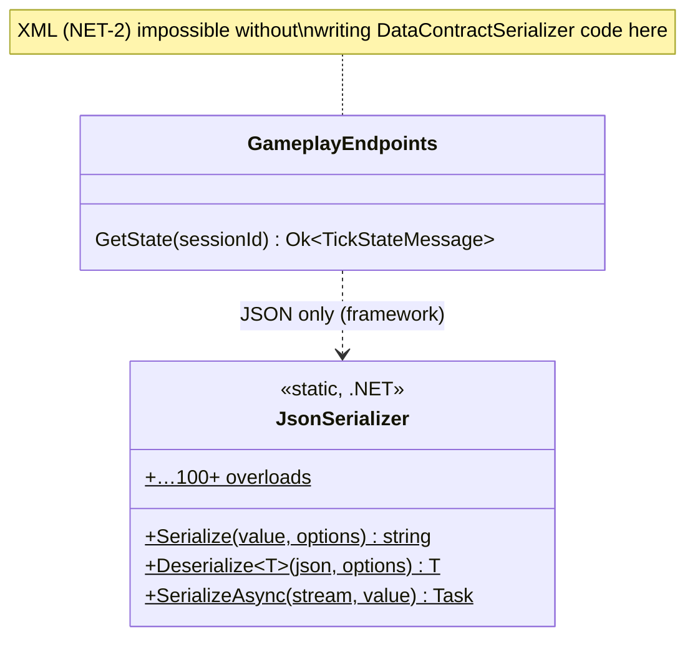
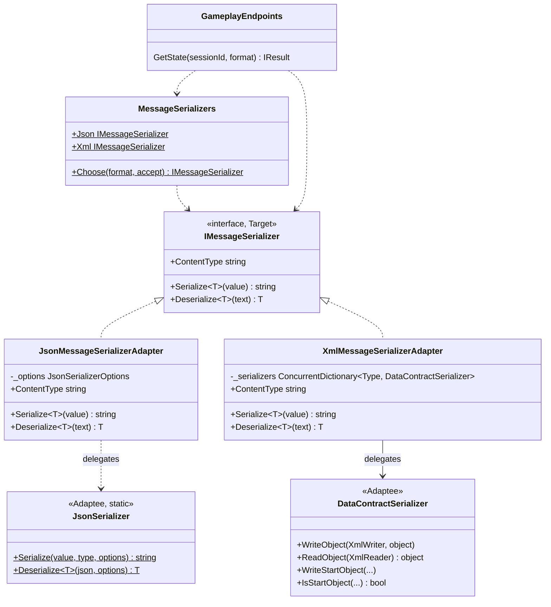

# Adapter — message serialization (JSON / XML)

**Owner:** Student C · **Category:** Structural · **Code:** `src/CastleEscape.Game/Messaging/`
**Demo:** `dotnet run --project src/CastleEscape.PatternDemos -- adapter --format xml` · `POST /api/patterns/adapter/demo?format=json|xml`
**Used by:** `GET /api/sessions/{id}/state?format=xml` (or `Accept: application/xml`); Phase 4 Bridge's `PollingBufferChannel`.

## Problem in this game

NET-2 lets messages travel as JSON or XML. The code that sends messages should not care which. But
.NET's two serializers have large APIs that look nothing alike:
- `System.Text.Json.JsonSerializer`: a static class, 100+ overloads over strings, streams, spans,
  `JsonNode`, type info and async variants.
- `DataContractSerializer`: one instance per type, writer/reader based (`WriteObject`, `ReadObject`,
  `WriteStartObject`, `IsStartObject`, …), needing `[DataContract]` types.

## Why Adapter

We already know the interface we want: *give me text in this format and turn text back into a
message*. The serializers already exist and we can't change them. An adapter per serializer
converts calls on our small interface into calls on the big one. That is the textbook situation:
an existing, incompatible API adapted to the interface the client expects.

## Participants

| Role | Class |
|---|---|
| Target | `IMessageSerializer` (`ContentType`, `Serialize<T>`, `Deserialize<T>`) |
| Adapter | `JsonMessageSerializerAdapter`, `XmlMessageSerializerAdapter` |
| Adaptee | `System.Text.Json.JsonSerializer`, `System.Runtime.Serialization.DataContractSerializer` |
| Client | `GameplayEndpoints.GetState` (and the polling channel, Bridge) via `MessageSerializers.Choose` |

## Before (tag `p1-prototype-before-patterns`)



## After



## Key code

```csharp
public string Serialize<T>(T value)            // XmlMessageSerializerAdapter
{
    var type = value?.GetType() ?? typeof(T);
    using var text = new Utf8StringWriter();
    using (var writer = XmlWriter.Create(text, WriterSettings))
        SerializerFor(type).WriteObject(writer, value);   // the adaptee's way of doing it
    return text.ToString();
}
```

The adapter also hides the adaptee's quirks:
- one `DataContractSerializer` per type (cached);
- `StringWriter` reports UTF-16 (fixed with `Utf8StringWriter`);
- the runtime type is used for `object` payloads.

**Making the messages XML-friendly** (brief §7.11). `DataContractSerializer` can't build positional
records (they have no parameterless constructor) and can't handle `IReadOnlyList<T>` members,
whose runtime type is a compiler-generated class. So the protocol records in
`CastleEscape.Contracts` carry `[DataContract(Namespace = "urn:castle-escape")]` and
`[property: DataMember]`, and use arrays and `Dictionary<,>` for collections. Their JSON is unchanged.
Round-trip tests cover every server message in both formats.

## Requirement: "adapter and adaptee have different numbers of methods"

Counted by reflection in `AdapterDemo.MemberCounts()` (and asserted in `AdapterTests`):

| Type | Public members |
|---|---|
| `IMessageSerializer` (target) | **3** (1 property, 2 methods) |
| `JsonSerializer` (adaptee) | **104** public static methods (.NET 10) |
| `DataContractSerializer` (adaptee) | **28** public instance methods |

## Likely live-change requests

| Request | Where to edit |
|---|---|
| "Add a third format (e.g. YAML/CSV)" | New class `XxxMessageSerializerAdapter : IMessageSerializer`; add a case in `MessageSerializers.Choose`. No caller changes. |
| "Use XmlSerializer instead of DataContractSerializer" | Only `XmlMessageSerializerAdapter`: swap the adaptee. XmlSerializer needs parameterless constructors, so explain why DataContractSerializer was chosen. |
| "Pretty/compact JSON" | `JsonDefaults.Create()` (`WriteIndented`). |
| "Show it's a class adapter vs object adapter" | These are object adapters (they hold or call the adaptee). A class adapter would inherit it, which is impossible here: `JsonSerializer` is static and `DataContractSerializer` is sealed. |
