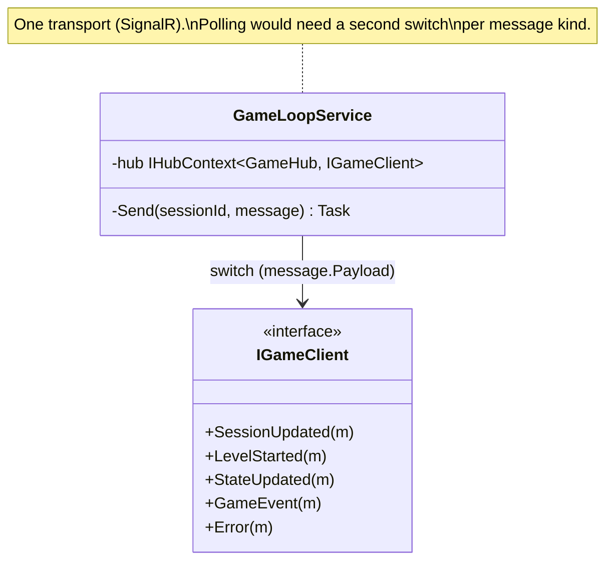
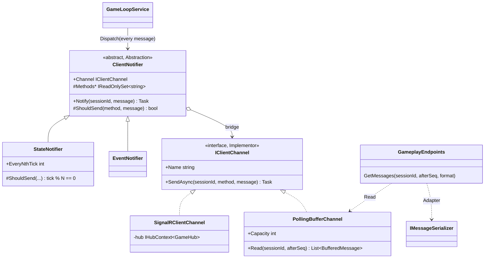

# Bridge — notifiers over delivery channels

**Owner:** Student C · **Category:** Structural · **Code:** `src/CastleEscape.Game/Messaging/` (`ClientNotifiers.cs`, `ClientChannels.cs`), `src/CastleEscape.Server/Realtime/SignalRClientChannel.cs`
**Demo:** `dotnet run --project src/CastleEscape.PatternDemos -- bridge --ticks 40 --pollingEvery 5 --format json` · `POST /api/patterns/bridge/demo?ticks=40&pollingEvery=5&format=xml`
**Used by:** `GameLoopService` (every outgoing message of every session), `GET /api/sessions/{id}/messages?afterSeq=&format=` (polling clients).
**Switch:** `Realtime:EnabledChannels = [SignalR, Polling]`, `Realtime:PollingStateEveryNthTick`, `Realtime:PollingBufferSize`.

## Problem in this game

Sessions produce two kinds of messages:
- **state**: `LevelStarted` and a `StateUpdated` every tick. Each one replaces the last, so an old one is worthless.
- **events**: `GameEvent`, `SessionUpdated`, `Error`. Each one matters, so losing one loses information.

They must reach clients over more than one transport. SignalR pushes to browsers. A polling buffer
serves clients that can't hold a connection (NET-2's "any client" idea, simple test tools, the
course's console clients). Each transport needs a different policy: a polling client can't use 20
states a second, but must not miss events.

In the prototype, `GameLoopService.Send` had a `switch` on the message type calling typed SignalR
methods, so there was one transport, and the policy was built into that switch. Adding polling the
same way would mean `switch (transport) × switch (message kind)`: every new transport or message
policy multiplies the cases (or the subclasses: `SignalRStateSender`, `PollingStateSender`,
`SignalREventSender`, …).

## Why Bridge

There are two independent dimensions: *what to send and when* (the policy per message kind) and
*how it travels* (the transport). Bridge separates them into two hierarchies connected by one
reference. Notifiers (the abstraction) hold a channel (the implementor) and call only
`SendAsync`. The policies are N notifiers, the transports M channels, and any notifier works over
any channel: N + M classes instead of N × M. The loop builds, per enabled channel, one state and one
event notifier, and gives every message to all of them.

## Participants

| Role | Class |
|---|---|
| Abstraction | `ClientNotifier` (holds `Channel`; `Notify(sessionId, message)` = filter by method + `ShouldSend` policy) |
| RefinedAbstraction | `StateNotifier` (LevelStarted always, StateUpdated every Nth tick), `EventNotifier` (GameEvent, SessionUpdated, Error, never skipped) |
| Implementor | `IClientChannel` (`Name`, `SendAsync(sessionId, method, message)`) |
| ConcreteImplementor | `SignalRClientChannel` (Server: hub group push), `PollingBufferChannel` (Game: per-session ring buffer, `Read(afterSeq)`); the demo adds `CountingChannel` |
| Client | `GameLoopService` (`ClientNotifiers.Dispatch`), wired in `Program.cs` from `Realtime` options |

`IServerMessage` (`SessionId`, `Seq`, `Tick`) is implemented by every server message, so channels
and notifiers never need a type switch. The polling endpoint serializes buffered messages with the
[Adapter](Adapter.md) (`IMessageSerializer`), so polled bodies come as JSON or XML.

## Before (tag `p1-prototype-before-patterns`)



## After



## Key code

```csharp
public Task? Notify(Guid sessionId, OutgoingMessage message) =>                       // ClientNotifier
    Methods.Contains(message.Method) && message.Payload is IServerMessage payload && ShouldSend(message.Method, payload)
        ? Channel.SendAsync(sessionId, message.Method, payload)                       // the bridge
        : null;

protected override bool ShouldSend(string method, IServerMessage message) =>         // StateNotifier
    method != ClientMethods.StateUpdated || message.Tick % EveryNthTick == 0;
```

```csharp
// Program.cs: notifiers × channels from configuration
var channels = realtime.EnabledChannels.Distinct().Select(c => c switch
{
    RealtimeChannel.SignalR => (IClientChannel)sp.GetRequiredService<SignalRClientChannel>(),
    _ => sp.GetRequiredService<PollingBufferChannel>(),
});
return ClientNotifiers.For(channels, new Dictionary<string, int> { ["Polling"] = realtime.PollingStateEveryNthTick });
```

## Requirement: "at least 2 abstractions and 2 implementations; how it differs from Strategy and Adapter"

- **Abstractions:** `ClientNotifier`, refined into `StateNotifier` and `EventNotifier`.
- **Implementations:** `SignalRClientChannel` and `PollingBufferChannel`, plus the demo's `CountingChannel`.
- **Differences:** see the last two rows of the table at the end of this page.

## Demonstration

The demo runs a real session for 40 ticks over two channels. One is the polling buffer, the other a
`CountingChannel` written in a few lines inside the demo, to show how cheap a new implementor is:

```text
Notifiers: StateNotifier over Counting; EventNotifier over Counting; StateNotifier over Polling; EventNotifier over Polling.
  EventNotifier over Counting            13
  EventNotifier over Polling             13      <- every event on both channels
  StateNotifier over Counting            41
  StateNotifier over Polling              9      <- LevelStarted + every 5th state
Polling buffer: 22 messages (8 StateUpdated: one every 5 ticks).
A poller reads them as application/json (Adapter); message #1 (GameEvent): {"sessionId":...,"seq":1,...}
```

`BridgeTests` checks the combinations, the per-notifier filtering, state thinning without event
loss, and the ring buffer. `PollingChannelTests` (server) polls a real game over HTTP in JSON and
XML, with `afterSeq` paging.

## Likely live-change requests

| Request | Where to edit |
|---|---|
| "Add a transport (e.g. WebSocket without SignalR, a file log, email on game over)" | One `IClientChannel` class and a `RealtimeChannel` value in `Program.cs`. Every notifier works with it at once. |
| "Add a policy (e.g. only send to players who are connected, or batch events)" | One `ClientNotifier` subclass; add it in `ClientNotifiers.For`. Every channel gets it. |
| "Turn polling off" | `Realtime:EnabledChannels = ["SignalR"]` (the endpoint then answers 400). |
| "Polling should get every state" | `Realtime:PollingStateEveryNthTick = 1`. |
| "Bridge vs Adapter?" | Adapter makes an *existing* incompatible API fit an interface we need (DataContractSerializer → `IMessageSerializer`), after the fact. Bridge is designed up front so two hierarchies can grow independently. Here they work together: the polling path uses both. |
| "Bridge vs Strategy?" | A strategy is one swappable algorithm inside one object ([Strategy.md](Strategy.md)). In Bridge, *both* sides are hierarchies: refined notifiers with their own policies × channels. |
