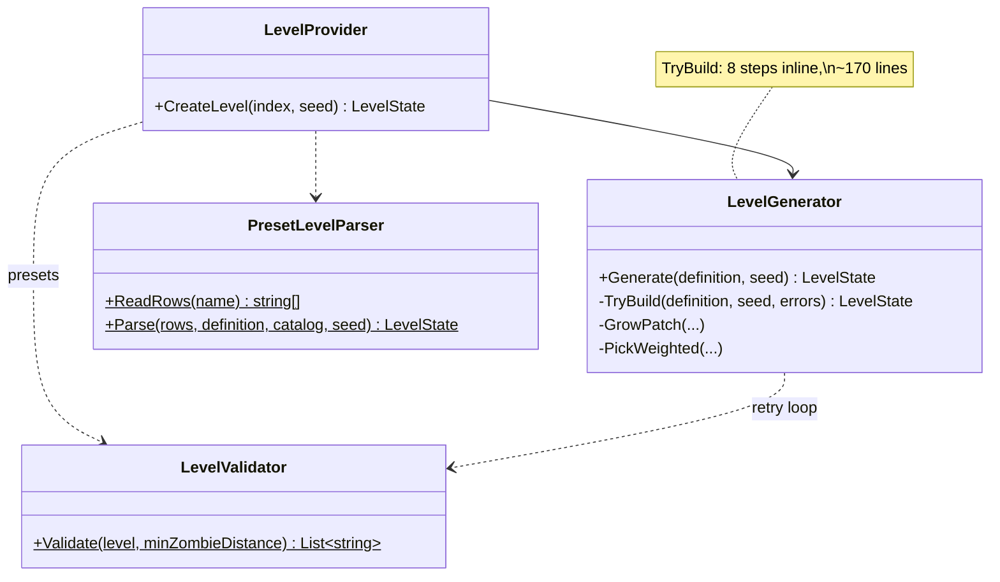
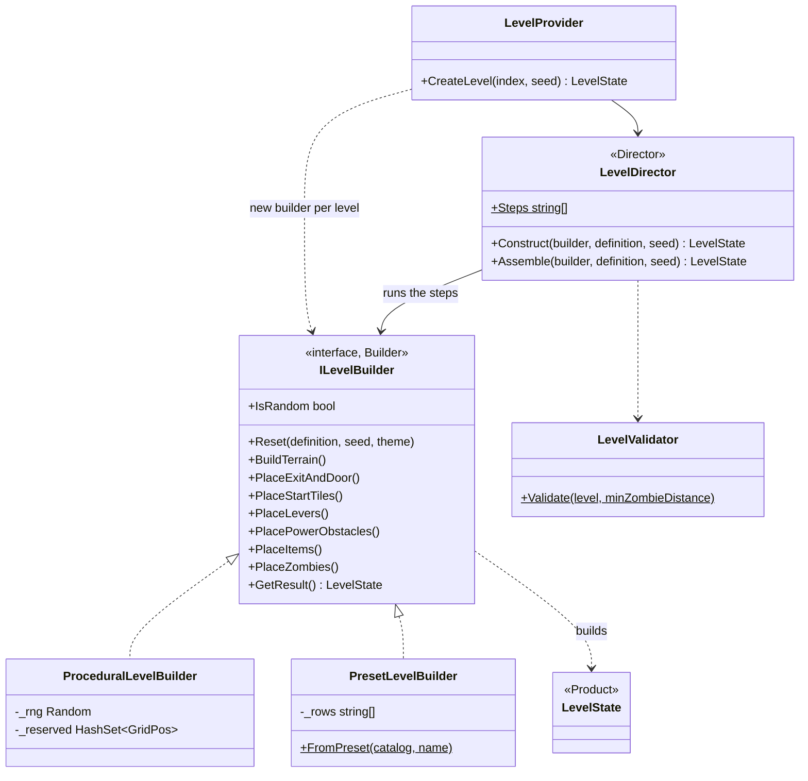

# Builder — level construction

**Owner:** Student A · **Category:** Creational · **Code:** `src/CastleEscape.Game/Generation/` (`ILevelBuilder`, `LevelDirector`, `ProceduralLevelBuilder`, `PresetLevelBuilder`)
**Demo:** `dotnet run --project src/CastleEscape.PatternDemos -- builder --level 7 --seed 3 --preset arena` · `POST /api/patterns/builder/demo?level=1&seed=7&preset=tutorial`
**Used by:** `LevelProvider` (every level a session plays), `DemoWorld`, the test maps (`TestGame.RowsLevelProvider`).

## Problem in this game

A level is built in many ordered steps with constraints between them. The door must exist before
the start tiles can be checked for a path to it; the levers before the power obstacles, which must
not cut the critical path (D5); items before zombies, which must not share tiles. Then the whole
level must pass validation (GEN-1..3, LVL-3), and a failure means another try with a new seed
(start-level activity diagram). There are also two very different ways to make a level: random
generation, and hand-made ASCII maps for tests, demos and the tutorial.

In the prototype this was a 250-line `LevelGenerator.TryBuild` doing all steps inline, plus a
separate `PresetLevelParser` that repeated the object placement in a character switch. The
validate-and-retry loop only worked for the generator.

## Why Builder

Builder separates *how a complex object is assembled* (the step order, validation, retries: the
director) from *how each part is made* (the concrete builders). Both level sources now run
through the same director and the same rules. Each step is a small method with one job, and a
third source (e.g. a level loaded from a database, or an editor) is one more builder. The result
(`LevelState`) is only handed out by `GetResult()` once all steps have run.

## Participants

| Role | Class |
|---|---|
| Builder | `ILevelBuilder` (`Reset`, 7 steps, `GetResult`, `IsRandom`) |
| ConcreteBuilder | `ProceduralLevelBuilder` (seeded random), `PresetLevelBuilder` (ASCII map) |
| Director | `LevelDirector` (`Construct`: steps + validation + retries; `Assemble`: steps only) |
| Product | `LevelState` |
| Client | `LevelProvider` (chooses the builder from `Generation:PresetLevel`) |

The director also passes the level's theme factory ([Abstract Factory](AbstractFactory.md)) to
`Reset`, and the item steps use the item spawners ([Factory Method](FactoryMethod.md)). The three
creational patterns work together: the factories make the parts and the builder puts them in place.

## Before (tag `p1-prototype-before-patterns`)



## After



## Key code

```csharp
public LevelState Construct(ILevelBuilder builder, LevelDefinition definition, int seed)   // LevelDirector
{
    var attempts = builder.IsRandom ? generation.MaxAttempts : 1;
    for (var attempt = 0; attempt < attempts; attempt++)
    {
        try
        {
            var level = Assemble(builder, definition, seed + attempt * 7919);
            errors = LevelValidator.Validate(level, generation.MinZombieDistanceFromStart);
            if (errors.Count == 0) return level;
        }
        catch (LevelBuildException ex) { errors = [ex.Message]; }   // a step found no room
    }
    throw new LevelGenerationException(definition.Index, errors);
}

public LevelState Assemble(ILevelBuilder builder, LevelDefinition definition, int seed)
{
    builder.Reset(definition, seed, ThemeFactories.For(definition, catalog));
    builder.BuildTerrain();
    builder.PlaceExitAndDoor();
    builder.PlaceStartTiles();
    builder.PlaceLevers();
    builder.PlacePowerObstacles();
    builder.PlaceItems();
    builder.PlaceZombies();
    return builder.GetResult();
}
```

## Requirement: "at least 2 concrete builders"

`ProceduralLevelBuilder` and `PresetLevelBuilder` implement every step differently. For example,
`PlaceLevers` picks two random reachable tiles at least 6 apart in one, and reads the `L`
characters in the other. `BuilderTests` checks:
- both builders exist and make valid levels of the right theme;
- the director calls the steps in order (with a recording builder);
- random builders are retried with new seeds, and preset builders are tried once;
- invalid presets are rejected.

The demo builds the same level definition with both and returns both maps as rows.

## Likely live-change requests

| Request | Where to edit |
|---|---|
| "Add a third builder (e.g. a maze, or levels from a database)" | A new `ILevelBuilder`; choose it in `LevelProvider.CreateBuilder`. Director and validation stay the same. |
| "Place levers before the exit" / "add a step (e.g. traps)" | `LevelDirector.Assemble` (the order) and a new method on `ILevelBuilder` with an implementation in each builder. |
| "Three levers instead of two" | `ProceduralLevelBuilder.PlaceLevers` (`_levers.Count < 2`); presets just add another `L`. The door logic already handles any number. |
| "More retries" | `Generation:MaxAttempts` in appsettings. |
| "Play a preset instead of random levels" | `Generation:PresetLevel = tutorial` (or `arena`). |
| "Difference from Abstract Factory?" | The factory decides *which* parts (themed classes); the builder decides *how and where* they are put together, step by step, and returns the finished level once. |
