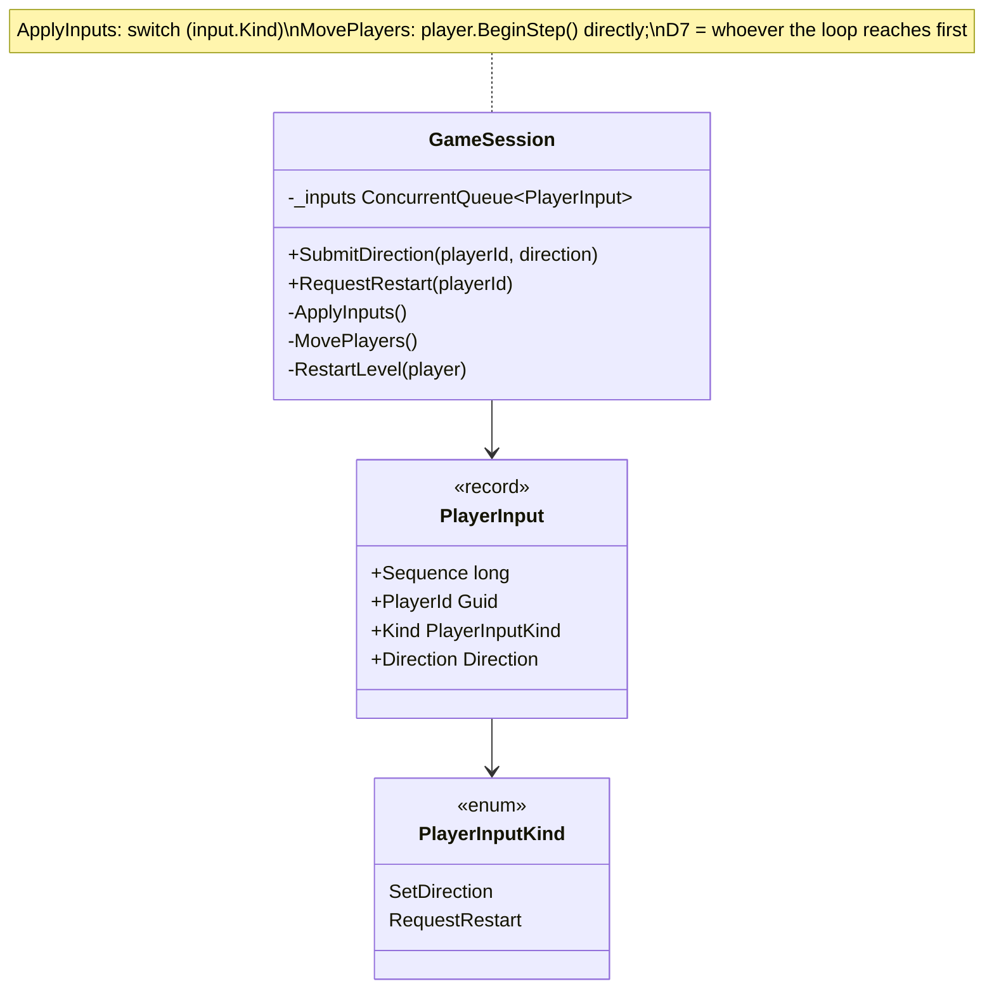
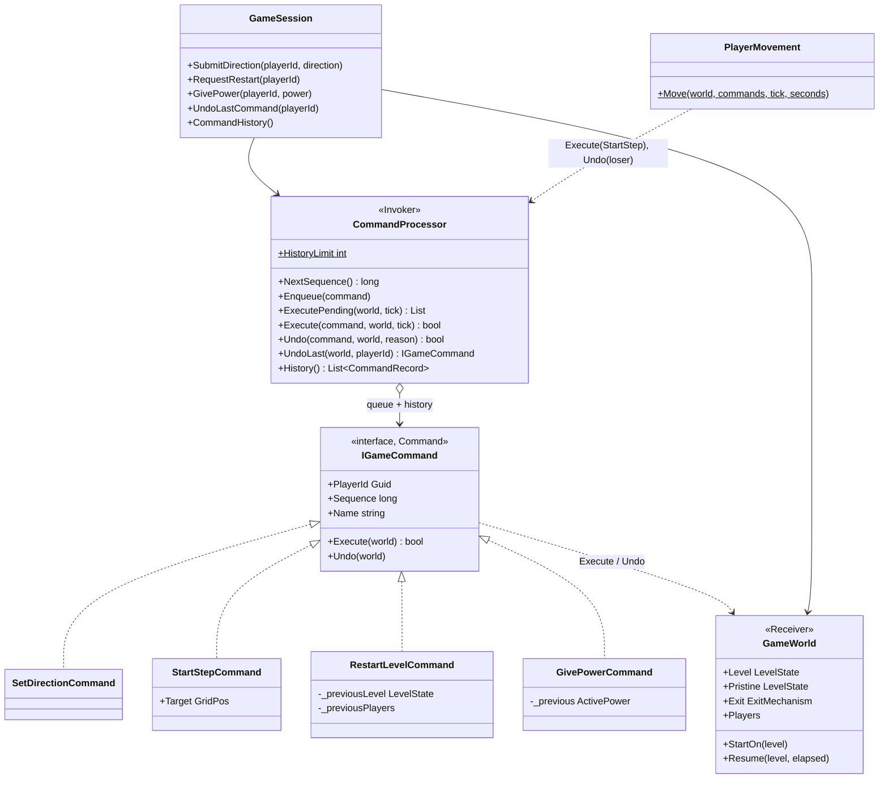

# Command — player inputs with undo

**Owner:** Student D · **Category:** Behavioral · **Code:** `src/CastleEscape.Game/Commands/`, `Sessions/GameWorld.cs`, `Sessions/PlayerMovement.cs`
**Demo:** `dotnet run --project src/CastleEscape.PatternDemos -- command` · `POST /api/patterns/command/demo?undoRestart=true`
**Used by:** `GameSession.SubmitDirection` / `RequestRestart` / `GivePower` (hub and REST inputs), `PlayerMovement` (every step), `GameSession.UndoLastCommand` (dev tools, Phase 5) and `CommandHistory` (diagnostics).

## Problem in this game

Inputs arrive on SignalR and HTTP threads at any time, but only the tick may change the world
(brief §4). So they must be queued, applied in a fixed order, and recorded for debugging. The course
also needs undo. In this game, undo is part of the rules: when both players step into the same free
tile in the same tick, one of the steps has to be taken back (D7).

The prototype queued `PlayerInput` records with a kind enum and a `switch` in `ApplyInputs`. Steps
were not objects at all: the player loop called `BeginStep` directly, and D7 was enforced by loop
order, so player 1 always won a tie. Nothing could be undone, and nothing was recorded.

## Why Command

Command turns each request into an object that has everything it needs to run *and to reverse
itself*. Objects can wait in a queue (thread-safe, ordered by sequence number), be logged, and be
undone later, without the session knowing what each one does. The invoker (`CommandProcessor`) only
knows `Execute`, `Undo`, `Sequence`. A new input type (e.g. "pull lever", "use item") is one new
class, not another `case`.

## Participants

| Role | Class |
|---|---|
| Command | `IGameCommand` (`PlayerId`, `Sequence`, `Name`, `Execute(world)`, `Undo(world)`) |
| ConcreteCommand | `SetDirectionCommand`, `StartStepCommand`, `RestartLevelCommand`, `GivePowerCommand` |
| Invoker | `CommandProcessor` (queue, `ExecutePending` in sequence order, bounded history of 100, `Undo`, `UndoLast`) |
| Receiver | `GameWorld` (level, pristine prototype, exit mechanism, players, checkpoint), extracted from `GameSession` |
| Client | `GameSession` (creates commands from inputs), `PlayerMovement` (creates step commands, resolves D7 conflicts) |

| Command | Execute | Undo |
|---|---|---|
| `SetDirectionCommand` | set held direction and its input sequence | previous direction and sequence |
| `StartStepCommand` | `BeginStep` towards the tile | `CancelStep` (player stays on its tile) |
| `RestartLevelCommand` | fresh prototype clone, stats from checkpoint (D8) | the level that was being played, lives, score and tiles |
| `GivePowerCommand` | gain or stack a power, refresh combos | previous timer and level (or none) |

## Before (tag `p1-prototype-before-patterns`)



## After



## Key code

```csharp
public void SubmitDirection(Guid playerId, Direction direction) =>            // GameSession (any thread)
    _commands.Enqueue(new SetDirectionCommand(_commands.NextSequence(), playerId, direction));

_commands.ExecutePending(_world, _tick);                                     // tick, step 1: in sequence order
```

```csharp
// PlayerMovement: players standing still choose their step at the same moment...
foreach (var player in players.Where(p => !p.IsMoving))
    if (TryStartStep(player, ...) is { } step) started.Add(step);

// ...and if two chose the same tile, the step from the later key press is undone (D7).
foreach (var conflict in started.GroupBy(s => s.Target).Where(g => g.Count() > 1))
    foreach (var loser in conflict.OrderBy(s => s.Sequence).Skip(1))
        commands.Undo(loser, world, "the other player claimed that tile first (D7)");
```

## Requirement: "commands must support undo()"

Every command implements `Undo`, and undo is used in two places:
1. **During play (D7).** When both players step into the same free tile in the same tick, the
   later input's `StartStepCommand` is undone. Clients get a `CommandUndone` game event.
2. **On request.** `GameSession.UndoLastCommand()` (the Phase 5 dev endpoint) undoes the most recent
   command. Undoing a restart brings back the level being played, with its collected items, and
   each player's score and position.

The demo shows both, then prints the history:

```text
Ana presses Right, then Ben presses Left: both StartStep commands target (2,1) in the same tick.
  The later one (Ben's) is undone -> Ana moving: True, Ben moving: False.
Ben walks right and picks up the coin: score 10, items left 0, Ben at (5,1).
Ana restarts the level: Ben's score 0, items 1, Ben at (3,1).
UndoLastCommand() -> undid 'RestartLevel': Ben's score 10, items 0, Ben at (5,1)
History: #1 Ana SetDirection Right / #2 Ben SetDirection Left / #1 Ana StartStep Right /
         #2 Ben StartStep Left [undone] / ... / #6 Ana RestartLevel [undone]
```

`CommandTests` checks each command's Execute/Undo round trip, the sequence order, the bounded
history, per-player undo, and the D7 conflict both ways round (whoever presses first wins).

**Known limit:** undoing a restart does not bring back the powers that were active before it. The
restart cleared them, and putting timers back needs a snapshot of the power state, which is the
P2 Memento's job. This is documented on `RestartLevelCommand`.

## Likely live-change requests

| Request | Where to edit |
|---|---|
| "Add an input (e.g. drop an item, emote)" | A new `IGameCommand` class and a `GameSession` method that enqueues it (plus a hub method). The processor doesn't change. |
| "Player 1 should always win ties" | `PlayerMovement.Move`: order the conflict by slot instead of `Sequence`. |
| "Undo only my own last move" | `UndoLastCommand(playerId)` already filters by player. |
| "Longer history" | `CommandProcessor.HistoryLimit`. |
| "Redo" | Keep undone entries in a redo stack in `CommandProcessor` and call `Execute` again. The commands already hold what they need. |
| "Replay a game" | The history is an ordered log of commands with ticks; re-running them on the same seed replays it (steps are deterministic). |
