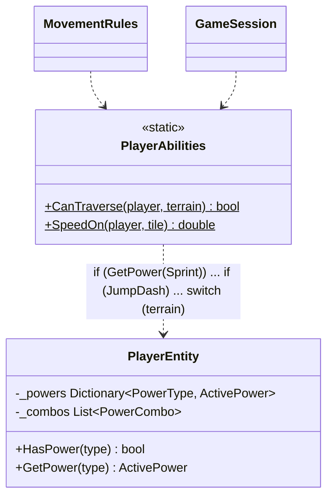
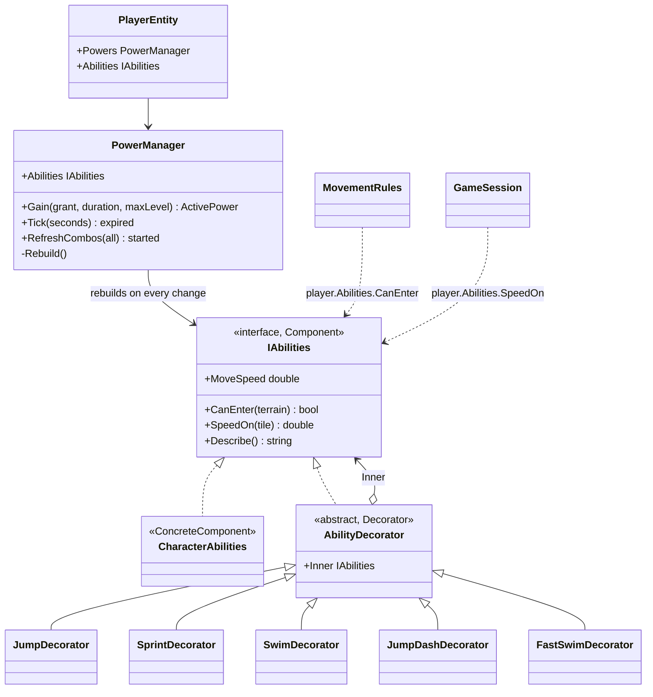

# Decorator — power stacking

**Owner:** Student B · **Category:** Structural · **Code:** `src/CastleEscape.Game/Powers/` (`Abilities.cs`, `PowerManager.cs`)
**Demo:** `dotnet run --project src/CastleEscape.PatternDemos -- decorator --character swimmer --sprints 3` · `POST /api/patterns/decorator/demo?character=scout&sprints=2`
**Used by:** `MovementRules.CanPlayerEnter` (`player.Abilities.CanEnter`), `GameSession.MovePlayers` (`player.Abilities.SpeedOn`).

## Problem in this game

Powers change what a player can do. Jump opens pits, Swim opens water, Sprint makes everything
faster. They stack: a second Sprint pickup is Sprint level 2 (PWR-3). Two powers together start a
combo (PWR-2): JumpDash (Jump + Sprint) is faster everywhere and much faster over pits, and FastSwim
(Sprint + Swim) removes the water slowdown. On top of that, the character has base stats (the
swimmer swims better).

The prototype had one static `PlayerAbilities` class that asked the player "do you have Sprint?
JumpDash? FastSwim?" and multiplied in a hard-coded order: 60 lines of `if`s and a terrain `switch`.
Each new power or combo meant editing it, the order of the multipliers was easy to break, and
nothing in the code showed that a combo is "the same abilities, plus a bit".

## Why Decorator

Each power *adds a behaviour on top of* the abilities below it, keeping the same interface. That is
exactly a decorator. A `SprintDecorator` wraps any `IAbilities` and multiplies its speed. A
`JumpDecorator` wraps any `IAbilities` and also allows pits. Stacking is wrapping again: Sprint
level 2 is two `SprintDecorator`s. Combos are decorators too, added last. The movement code only
ever calls `player.Abilities`; it doesn't know how many layers there are. A new power is a new
decorator class and nothing else changes.

## Participants

| Role | Class |
|---|---|
| Component | `IAbilities` (`MoveSpeed`, `CanEnter(terrain)`, `SpeedOn(tile)`, `Describe()`) |
| ConcreteComponent | `CharacterAbilities` (the character's base stats: floor only) |
| Decorator | `AbilityDecorator` (abstract; holds `Inner` and passes everything through) |
| ConcreteDecorator | `JumpDecorator`, `SprintDecorator`, `SwimDecorator`, `JumpDashDecorator`, `FastSwimDecorator` |
| Builds the chain | `PowerManager.Rebuild()`: character, then one decorator per stack level of Jump, Sprint, Swim, then combos |
| Client | `MovementRules`, `GameSession.MovePlayers` |

## Before (tag `p1-prototype-before-patterns`)



## After



## Key code

```csharp
public sealed class SprintDecorator(IAbilities inner, StatModifiers modifiers) : AbilityDecorator(inner)
{
    public override double MoveSpeed => Inner.MoveSpeed * modifiers.MoveSpeedMultiplier;
    public override double SpeedOn(Tile tile) => Inner.SpeedOn(tile) * modifiers.MoveSpeedMultiplier;
}

public sealed class FastSwimDecorator(IAbilities inner, StatModifiers modifiers) : AbilityDecorator(inner)
{
    // Replaces what the inner chain says about water instead of multiplying it.
    public override double SpeedOn(Tile tile) =>
        tile.Terrain == TerrainKind.Water ? Inner.MoveSpeed * modifiers.SwimSpeedMultiplier : Inner.SpeedOn(tile);
}
```

```csharp
private void Rebuild()                                                     // PowerManager
{
    IAbilities abilities = new CharacterAbilities(_character);
    foreach (var type in BaseOrder)                                        // Jump, Sprint, Swim
        if (_powers.TryGetValue(type, out var power))
            for (var level = 0; level < power.Level; level++)
                abilities = Decorate(abilities, power.Grant);              // one layer per stack level
    foreach (var combo in _combos)
        abilities = Decorate(abilities, combo);                            // JumpDash, FastSwim
    Abilities = abilities;
}
```

## Requirement: "at least 3 decoration levels"

The demo builds the chain step by step (scout, two Sprints, Jump, Swim) and prints its depth and speeds:

```text
Scout (no powers)      depth 0: Scout                              floor 6.00  water closed  pit closed
+ Sprint               depth 1: Scout + Sprint                     floor 9.00  water closed  pit closed
+ Sprint               depth 2: Scout + Sprint + Sprint            floor 13.50 water closed  pit closed
+ Jump                 depth 4: Scout + Jump + Sprint + Sprint + JumpDash                    pit 39.49
+ Swim                 depth 6: Scout + Jump + Sprint + Sprint + Swim + JumpDash + FastSwim  water 27.00
all expired            depth 0: Scout
```

`DecoratorTests` checks the depth, that each decorator changes only its own thing, that stacking
adds layers, and that the chain unwinds when timers expire. It also checks that the speeds match the
prototype's formulas exactly, so the refactor changed no game rule.

## Likely live-change requests

| Request | Where to edit |
|---|---|
| "Add a new power (e.g. Ghost: walk through walls for 5 s)" | `PowerType.Ghost`, a `PowerGrant` subclass and item in content, a `GhostDecorator` (`CanEnter(Wall) = true`, which also needs the wall check in `MovementRules` to ask the abilities), and one case in `PowerManager.Decorate`. |
| "Add a combo" | Data in `content/combos.json`, plus a decorator class if it does something new. |
| "Sprint should not stack" | `Game:MaxPowerStackLevel = 1` (no code). |
| "Show the chain in the HUD" | `player.Abilities.Describe()`. |
| "Decorator vs Composite?" | Both wrap objects of the same interface. A decorator has exactly one inner object and adds behaviour to it. A composite has many children and combines them into a tree (P2's Composite could group level parts). |
| "Why not just multiply the numbers?" | Powers change more than numbers: Jump and Swim change *where* you can go, and FastSwim *replaces* the water rule. Each is one small class instead of branches in one method. |
