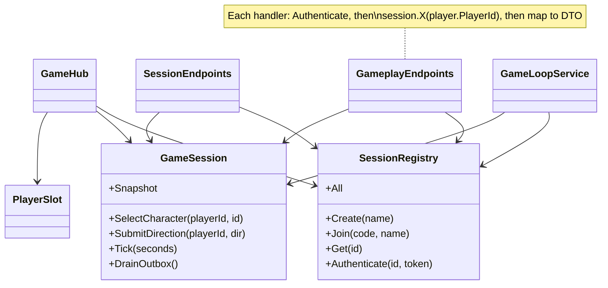
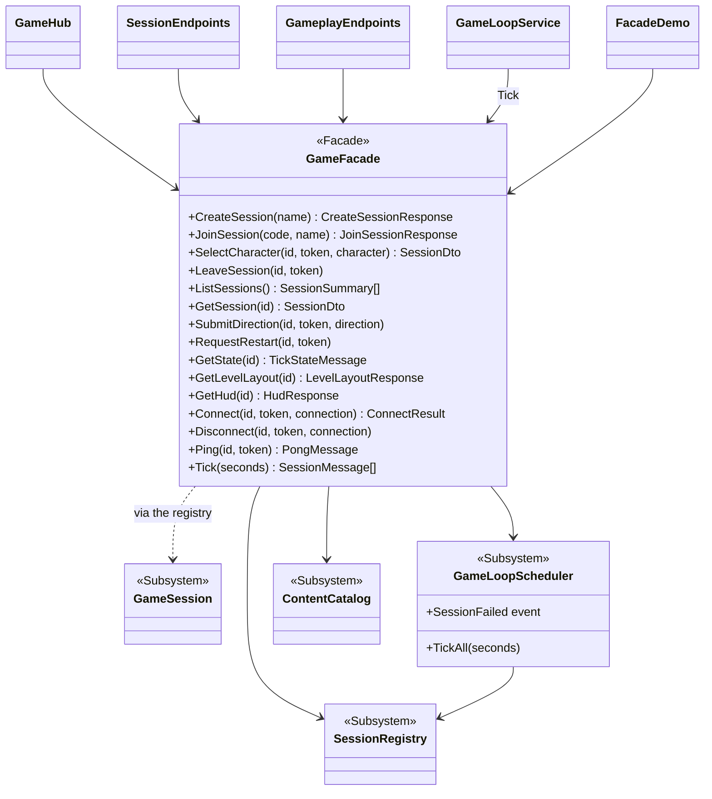

# Facade — one entry point to the game

**Owner:** Student D · **Category:** Structural · **Code:** `src/CastleEscape.Game/Sessions/GameFacade.cs`, `Sessions/GameLoopScheduler.cs`
**Demo:** `dotnet run --project src/CastleEscape.PatternDemos -- facade` · `POST /api/patterns/facade/demo`
**Used by:** `GameHub` (all hub methods), `SessionEndpoints` and `GameplayEndpoints` (all lobby and gameplay REST), `GameLoopService` (`Tick`), and `FacadeDemo`, which plays a whole game in-process.

## Problem in this game

To do anything, a client of the game used to talk to several parts:
- `SessionRegistry`, to find the session and check the player token;
- `GameSession`, for lobby calls and queued inputs;
- the session's snapshot, for reads;
- `PlayerSlot`, for ids and tokens;
- the loop, to tick sessions and drain their outboxes.

Every endpoint repeated `registry.Authenticate(...)` then `session.X(player.PlayerId, ...)`, and
then built a DTO from the session and slot. The hub kept its own copy of the catch-up logic (what
to send a reconnecting client). `GameLoopService` handled per-session failure handling and outbox
draining inline. Changing how sessions are found or authenticated meant editing all of them.

## Why Facade

Facade gives a complex subsystem one simple, task-shaped interface: "create a session", "join with
this code", "this token pressed Left", "give me the HUD". `GameFacade` does the lookups, the token
check and the mapping to contract DTOs, and calls the right subsystems. The hub, the endpoints and
the demo now depend on one class and only see DTOs. They never see a `GameSession`, `PlayerSlot`,
command or level, so those can change freely. The subsystems are still public, and tests and the
diagnostics endpoint use them directly. A facade simplifies; it doesn't lock anyone out.

## Participants

| Role | Class |
|---|---|
| Facade | `GameFacade` (lobby: `CreateSession`, `JoinSession`, `SelectCharacter`, `LeaveSession`, `ListSessions`, `GetSession`, `CharacterIds`; input: `SubmitDirection`, `RequestRestart`; reads: `GetState`, `GetLevelLayout`, `GetHud`; hub: `Connect`, `Disconnect`, `Ping`; loop: `Tick`) |
| Subsystems | `SessionRegistry` (lookup, join codes, tokens), `GameSession` (and behind it `CommandProcessor`, `GameWorld`, `GameEventPublisher`), `GameLoopScheduler` (new: ticks all sessions, isolates failures, drains outboxes), `ContentCatalog`; level creation runs through `ILevelProvider` → `LevelDirector` |
| Clients | `GameHub`, `SessionEndpoints`, `GameplayEndpoints`, `GameLoopService`, `FacadeDemo` |

## Before (tag `p1-prototype-before-patterns`)



## After



## Key code

```csharp
public void SubmitDirection(Guid sessionId, string? playerToken, Direction direction)   // GameFacade
{
    var (session, player) = registry.Authenticate(sessionId, playerToken);
    session.SubmitDirection(player.PlayerId, direction);
}
```

```csharp
private static Accepted SubmitInput(Guid sessionId, DirectionRequest request, HttpContext http, GameFacade game)   // REST
{
    game.SubmitDirection(sessionId, http.PlayerToken(), request.Direction);
    return TypedResults.Accepted((string?)null);
}

public void SetDirection(Direction direction)                                           // hub
{
    var (sessionId, token) = RequirePlayer();
    game.SubmitDirection(sessionId, token, direction);
}
```

```csharp
var sends = game.Tick(tickSeconds)                                                      // GameLoopService
    .SelectMany(m => ClientNotifiers.Dispatch(notifiers, m.SessionId, m.Message))
    .ToList();
```

## Demonstration

`FacadeDemo` builds the subsystems once, the way `Program.cs` does, and then plays a complete
one-level game using nothing but `GameFacade`. Two bots walk onto the levers, through the door and
onto the exits:

```text
CreateSession, JoinSession(code J8B8WP), SelectCharacter x2 -> phase Playing, level 1.
Ana and Ben walk onto the levers (SubmitDirection, Tick): door open = True.
Both walk through the door onto the exit tiles -> phase Victory after 60 ticks.
32 lobby and input calls to the facade (plus state reads); it delivered 89 messages (GameEvent 21, LevelStarted 1, ...).
```

`FacadeTests` covers the lobby, token errors, the "no level yet" error, connection catch-up, and a
broken session being stopped by the scheduler. The server's integration tests (REST lobby,
two SignalR clients finishing a level, polling, XML) all run through the facade.

## Likely live-change requests

| Request | Where to edit |
|---|---|
| "Add a spectator mode / a new client operation" | One `GameFacade` method; the hub and an endpoint call it. |
| "Authenticate differently (e.g. JWT instead of the player token)" | `GameFacade` (and `SessionRegistry.Authenticate`); no endpoint or hub method changes. |
| "Remove finished sessions after 10 minutes" | `GameLoopScheduler` / `SessionRegistry`; clients are unaffected. |
| "Can callers still reach the subsystems?" | Yes, a facade simplifies access but doesn't forbid it: diagnostics reads `SessionRegistry` directly, and tests build sessions directly. |
| "Facade vs Adapter?" | Adapter converts one existing interface into another one a client expects ([Adapter.md](Adapter.md)). Facade defines a *new, simpler* interface over many classes. |
| "Facade vs Mediator?" | The facade is one-way: clients call it, and the subsystems don't know it exists. A mediator coordinates colleagues that talk to each other through it. |
