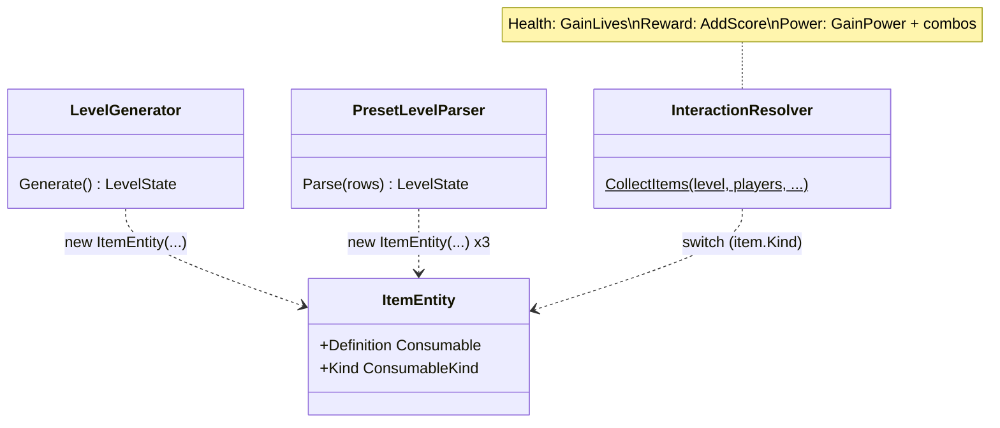
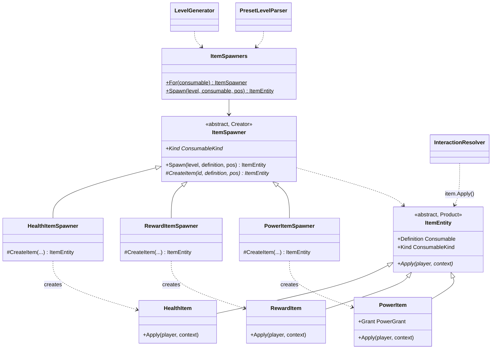

# Factory Method — item spawners

**Owner:** Student B · **Category:** Creational · **Code:** `src/CastleEscape.Game/Items/`, `World/ItemEntity.cs`
**Demo:** `dotnet run --project src/CastleEscape.PatternDemos -- factory-method --kind power` · `POST /api/patterns/factory-method/demo?kind=health|reward|power|all`
**Used by:** the level generator and the preset parser (placing items), `InteractionResolver.CollectItems` (pickup).

## Problem in this game

ITM-1 has three item kinds: Health (+1 life), Reward (score) and Power (a temporary power). In the
prototype there was one `ItemEntity` class holding a content definition, and the pickup code had a
`switch` on the kind. Every place that created items (`new ItemEntity(...)` in the generator and
in the preset parser) and every place that used them had to know all kinds. Adding a fourth kind
(say, a trap or a key) meant editing the switch and each creation site.

## Why Factory Method

Placing an item always takes the same steps: check the tile is free floor, give the item a unique
id, register it on the level. Only one step differs, *which class to create*. Factory Method
puts the fixed steps in the creator (`ItemSpawner.Spawn`) and leaves that one step,
`CreateItem`, to subclasses. The products carry their own behaviour (`Apply`), so the pickup
code no longer switches on the kind.

## Participants

| Role | Class |
|---|---|
| Product | `ItemEntity` (abstract; `Apply(player, context)`) |
| ConcreteProduct | `HealthItem`, `RewardItem`, `PowerItem` |
| Creator | `ItemSpawner` (abstract; `Spawn()` is the template, `CreateItem()` the factory method) |
| ConcreteCreator | `HealthItemSpawner`, `RewardItemSpawner`, `PowerItemSpawner` |
| Client | `LevelGenerator`, `PresetLevelParser` (via `ItemSpawners.For(consumable)`), `InteractionResolver` (uses products) |

## Before (tag `p1-prototype-before-patterns`)



## After



## Key code

```csharp
public ItemEntity Spawn(LevelState level, Consumable definition, GridPos pos)   // ItemSpawner
{
    // same for every kind: right kind? floor? free?
    ...
    var item = CreateItem(level.NextEntityId("item"), definition, pos);   // the factory method
    level.AddItem(item);
    return item;
}

protected override ItemEntity CreateItem(string id, Consumable definition, GridPos pos)   // PowerItemSpawner
    => new PowerItem(id, (Power)definition, pos);
```

Pickup (`InteractionResolver.CollectItems`) is now one line per item, `item.Apply(player, context)`.

## Requirement: "at least 3 classes in the product family"

`HealthItem`, `RewardItem` and `PowerItem`, all subclasses of `ItemEntity`, each with a different
effect. `FactoryMethodTests.ProductFamily_HasAtLeastThreeClasses` finds them by reflection. The demo
lists them and applies each one to a player (lives 2→3, score 0→10, powers 0→1).

## Likely live-change requests

| Request | Where to edit |
|---|---|
| "Add a new item kind (e.g. a Trap that costs a life)" | A `Consumable` subclass and `ConsumableKind` value; `TrapItem : ItemEntity` with its `Apply`; `TrapItemSpawner`; add it to `ItemSpawners.All`. Pickup code is unchanged. |
| "Health potion should heal 2" | Data: `healthValue` in `content/consumables.json`. |
| "Let health potions go over the maximum" | `HealthItem.Apply` (or `PlayerEntity.GainLives`, D14). |
| "Items must not spawn next to walls" | `ItemSpawner.Spawn`, the shared step, so it holds for every kind. |
| "Difference from Abstract Factory?" | Factory Method: one product, the subclass picks its class (inheritance). Abstract Factory: an object that creates a whole family of related products (composition). See [AbstractFactory.md](AbstractFactory.md). |
