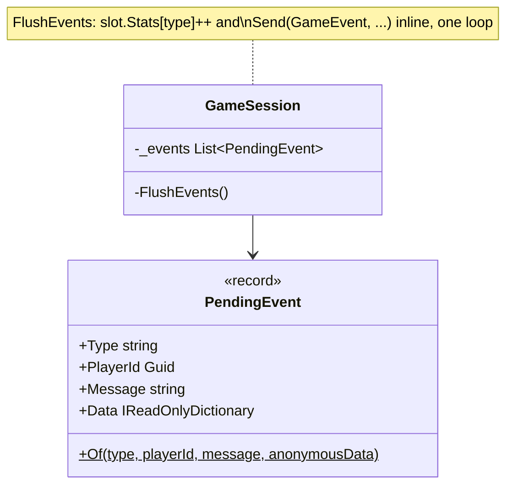
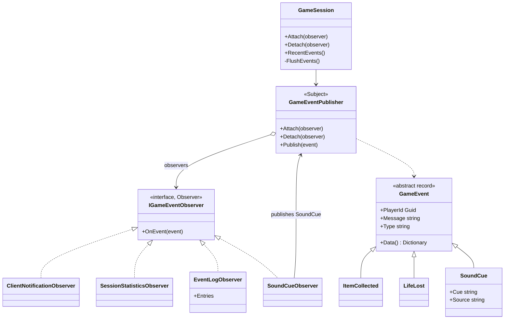

# Observer — game events

**Owner:** Student D · **Category:** Behavioral · **Code:** `src/CastleEscape.Game/Events/` (`GameEvents.cs`, `GameEventPublisher.cs`, `Observers.cs`)
**Demo:** `dotnet run --project src/CastleEscape.PatternDemos -- observer` · `POST /api/patterns/observer/demo`
**Used by:** every `GameSession` (one publisher per session). The game rules report events; clients receive them as `GameEvent` messages.

## Problem in this game

Many things happen during a tick: an item is collected, a life lost, a lever pulled, the door
opens. Each fact matters to several parts of the system:
- the clients need a message (with sound and animation);
- the HUD counts per-player statistics (view-game-state diagram);
- diagnostics keep a log;
- sounds must be chosen.

In the prototype, `GameSession.FlushEvents` did all of that in one loop: it counted stats and built
the message inline. Events were stringly typed (`PendingEvent.Of("ItemCollected", ..., new { … })`
with an anonymous object read by reflection). Adding a reaction (a log, sound cues, achievements)
meant editing the session again.

## Why Observer

The rules that detect events should not know who cares about them. Observer gives a subject
(`GameEventPublisher`) that keeps a list of observers and notifies each one of every event.
Reactions become independent classes that can be attached or detached at runtime. The session
wires up four; tests and demos attach their own. Events became typed records, so each event's data
is checked by the compiler, and its wire name is its class name.

## Participants

| Role | Class |
|---|---|
| Subject | `GameEventPublisher` (`Attach`, `Detach`, `Publish`) |
| Observer | `IGameEventObserver` (`OnEvent(GameEvent)`) |
| ConcreteObserver | `ClientNotificationObserver` (outbox → SignalR), `SessionStatisticsObserver` (HUD stats), `EventLogObserver` (last 200, for diagnostics), `SoundCueObserver` (event → `SoundCue` event) |
| Event (the notification) | `GameEvent` and 19 records: `ItemCollected`, `LifeLost`, `DoorOpened`, … `SoundCue` |
| Event sources | `InteractionResolver`, `ExitMechanism`, `PowerRules`, `PowerItem`, commands, `GameSession` (they add to `GameWorld.Events`) |

Events are collected during the tick and published at its end, so observers always see a
consistent world (the tick has finished changing it).

## How it works (sequence)

A tick where a player picks up a coin:

```mermaid
sequenceDiagram
    participant Loop as GameLoopService
    participant S as GameSession
    participant R as InteractionResolver
    participant P as GameEventPublisher
    participant C as ClientNotificationObserver
    participant St as SessionStatisticsObserver
    participant L as EventLogObserver
    participant Snd as SoundCueObserver

    Loop->>S: Tick(0.05)
    S->>R: CollectItems(level, players, ...)
    R->>R: item.Apply(player) and remove item
    R-->>S: world.Events += ItemCollected
    Note over S: rest of the tick (zombies, levers, exit), then SendState
    S->>S: FlushEvents()
    S->>P: Publish(ItemCollected)
    P->>C: OnEvent(ItemCollected)
    C-->>S: outbox += GameEvent message
    P->>St: OnEvent(ItemCollected)
    St->>St: Ana.Stats["ItemCollected"]++
    P->>L: OnEvent(ItemCollected)
    L->>L: append (keep last 200)
    P->>Snd: OnEvent(ItemCollected)
    Snd->>P: Publish(SoundCue "pickup")
    P->>C: OnEvent(SoundCue)
    C-->>S: outbox += GameEvent message
    P->>St: OnEvent(SoundCue) (ignored)
    P->>L: OnEvent(SoundCue)
    P->>Snd: OnEvent(SoundCue) (no cue for a cue)
    Loop->>S: DrainOutbox() and send to the SignalR group
```

## Before (tag `p1-prototype-before-patterns`)



## After



## Key code

```csharp
// GameSession constructor: who reacts to events, in notification order.
_events.Attach(new ClientNotificationObserver(e =>
    Send(ClientMethods.GameEvent, new GameEventMessage(Id, NextSeq(), _tick, e.Type, e.PlayerId, e.Message, e.Data()))));
_events.Attach(new SessionStatisticsObserver(_slots));
_events.Attach(_eventLog);
_events.Attach(new SoundCueObserver(_events));

private void FlushEvents()                          // end of every tick
{
    var events = _world.Events.ToList();
    _world.Events.Clear();
    foreach (var e in events) _events.Publish(e);
}
```

```csharp
public sealed record LifeLost(Guid? PlayerId, string Message, string ZombieId, int Lives) : GameEvent(PlayerId, Message);
// Type = "LifeLost"; Data() = { "zombieId": "zombie-1", "lives": "2" }
```

## Requirement: "show how it works with a sequence diagram"

The sequence diagram above follows one real tick. The demo runs it live. It attaches a Recorder
observer, plays a coin pickup and a zombie hit, and prints what each observer did. Then it detaches
the Recorder and shows it stops receiving events, while the event log keeps growing:

```text
The Recorder saw, in order: SoundCue(pickup), ItemCollected, SoundCue(life_lost), LifeLost.
Recorder detached; 40 more ticks: it still has 4 events (was 4), while the EventLog observer kept going (17 entries).
SessionStatistics: Ana ItemCollected 1; Ben LifeLost 3.
SoundCue turned events into cues: pickup, life_lost, life_lost, life_lost, game_over.
```

The Recorder sees each cue *before* its event. The SoundCue observer is attached before the Recorder
and publishes the cue while the event is still being delivered (a nested notification). The clients
are notified first, so they get the event and then its cue. `ObserverTests` checks this order in a
real session, as well as attach, detach, statistics, the log limit, and that every event class has a
`GameEventTypes` wire name.

## Likely live-change requests

| Request | Where to edit |
|---|---|
| "Add achievements (e.g. 10 coins)" | A new `AchievementObserver` counting `ItemCollected`, publishing an `AchievementUnlocked` event; attach it in `GameSession`. No rule changes. |
| "No sound when collecting coins" | `SoundCueObserver.Cues`. |
| "Log events to the console/file" | Another observer, or attach one at runtime with `session.Attach(...)`. |
| "A new event type" | A `GameEvent` record, a `GameEventTypes` constant, and the rule that adds it to `world.Events`. |
| "Observer vs Mediator?" | Here the publisher only broadcasts: observers don't talk to each other and the subject has no logic. A Mediator (P2 seam: `ExitMechanism` for levers and door) holds the coordination logic between colleagues that would otherwise reference each other. |
