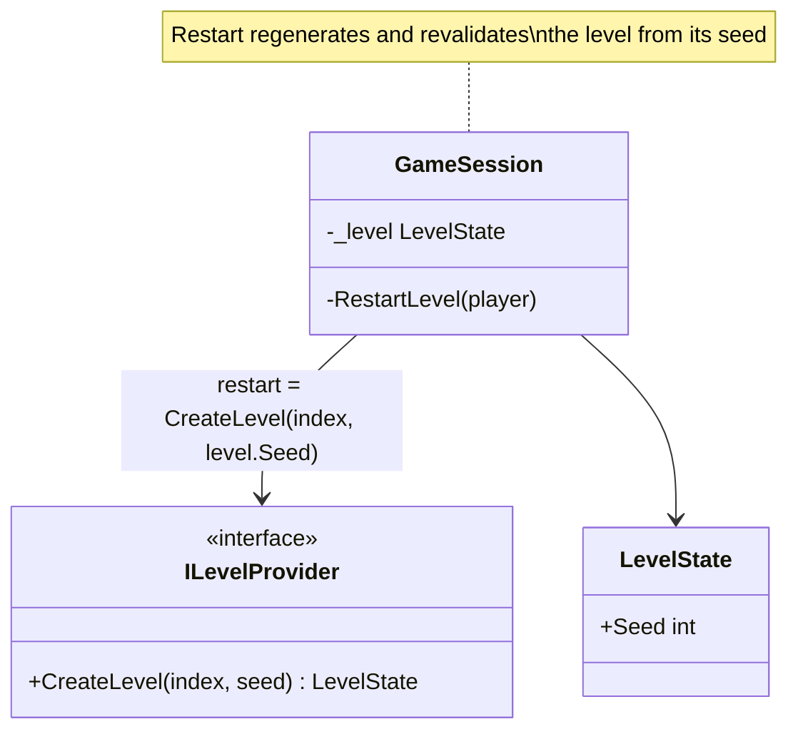
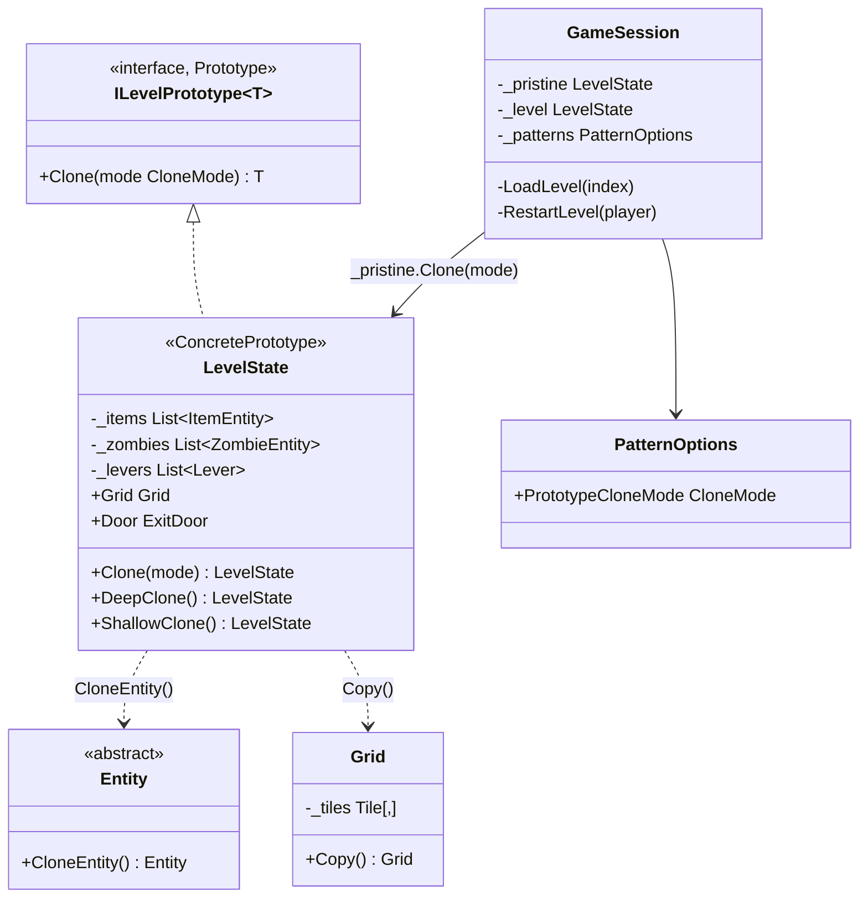

# Prototype — level restart copies

**Owner:** Student A · **Category:** Creational · **Code:** `src/CastleEscape.Game/World/LevelState.cs` (`Clone`, `DeepClone`, `ShallowClone`), `World/ILevelPrototype.cs`, `Entity.CloneEntity`, `Grid.Copy`
**Demo:** `dotnet run --project src/CastleEscape.PatternDemos -- prototype --mode Shallow` · `POST /api/patterns/prototype/demo?mode=Deep|Shallow|both`
**Used by:** `GameSession.LoadLevel` (play on a clone) and `GameSession.RestartLevel` (D8: restart = a new clone).
**Switch:** `Patterns:PrototypeCloneMode = Deep | Shallow` in appsettings. The session reads it on every restart.

## Problem in this game

Restart (D8) must bring the level back exactly as it was built: every item back, zombies at
their spawns, levers off, door closed. The prototype regenerated the level from its seed through the
generator. That repeats all the construction and validation work, and it only works if generation is
perfectly deterministic (it breaks for any source that isn't seeded, and for levels changed after
building, e.g. by dev tools). Restoring each part by hand would miss parts as the level grows.

## Why Prototype

The simplest way to get "the level as it was" is to keep that level untouched and copy it. A copy
is made by the object itself, since only `LevelState` knows all its private lists and how deep each
part must be copied. The session keeps the freshly built level as a prototype (`_pristine`), plays on
`_pristine.Clone(mode)` and restarts with another clone. No regeneration, no validation, no seed.

The course also asks to compare deep and shallow copies, and here the difference is visible in
the game. A shallow copy shares the lists and entities, so playing on it changes the pristine level
and the restart comes back with the items already collected.

## Participants

| Role | Class |
|---|---|
| Prototype | `ILevelPrototype<T>` (`Clone(CloneMode)`) |
| ConcretePrototype | `LevelState` (`DeepClone`, `ShallowClone`) |
| Parts that copy themselves | `Entity.CloneEntity()` (items, zombies, levers, door), `Grid.Copy()` |
| Client | `GameSession` (keeps `_pristine`; `LoadLevel`, `RestartLevel`) |

| Part | Deep clone | Shallow clone |
|---|---|---|
| `LevelState` | new | new (`MemberwiseClone`) |
| `Grid` and its tile array | new array | **shared** |
| `Tile` objects | shared (immutable) | shared |
| item/zombie/lever lists | new lists | **shared** |
| item, zombie, lever and door objects | new (`CloneEntity`) | **shared** |
| `LevelDefinition`, obstacles, consumables | shared (read-only content) | shared |

Sharing the immutable parts is intentional. A deep copy only needs to copy what play can change.
Copying immutable tiles would cost memory and gain nothing (the P2 Flyweight will share them further).

## Before (tag `p1-prototype-before-patterns`)



## After



## Key code

```csharp
public LevelState DeepClone()
{
    var copy = new LevelState(Definition, Seed, Grid.Copy());          // new tile array, same immutable tiles
    copy._items.AddRange(_items.Select(i => (ItemEntity)i.CloneEntity()));
    copy._zombies.AddRange(_zombies.Select(z => (ZombieEntity)z.CloneEntity()));
    copy._levers.AddRange(_levers.Select(l => (Lever)l.CloneEntity()));
    ...
    copy.Door = (ExitDoor?)Door?.CloneEntity();
    return copy;
}

public LevelState ShallowClone() => (LevelState)MemberwiseClone();   // shares grid, lists and entities
```

```csharp
private void RestartLevel(PlayerEntity requestedBy)                    // GameSession
{
    var level = _pristine!.Clone(_patterns.PrototypeCloneMode);
    ...
}
```

`CloneEntity()` is `MemberwiseClone()`. That is a complete copy for entities, because they hold
only values (positions, flags) and shared read-only content definitions. The copy keeps its
class, so a `CryptZombie` clones as a `CryptZombie` and a `PowerItem` as a `PowerItem`.

## Requirement: "compare deep and shallow copies and report memory addresses; switch at the defence"

The demo prints, for the level, grid, items list, first item, first lever, door, one tile and the
definition, the **memory address** and the **identity hash** in the original and the clone, and
whether they are the same object:

```text
Deep clone of the tutorial level:
  level       original 0x1318219AAD8 (hash   1453207)  clone 0x13182225E00 (hash  18891694)  different object
  items list  original 0x1318219AB38 (hash  31775691)  clone 0x13182225E60 (hash  10430802)  different object
  tile (1,1)  original 0x13182197DC8 (hash  46629368)  clone 0x13182197DC8 (hash  46629368)  SAME object
  ...
  Restart = pristine.Clone(Deep): 5/5 items, lever-1 off -> restored correctly.
Shallow clone of the tutorial level:
  items list  original 0x1318223B4F0 (hash  10586013)  clone 0x1318223B4F0 (hash  10586013)  SAME object
  ...
  Restart = pristine.Clone(Shallow): 4/5 items, lever-1 ON -> NOT restored
```

Addresses are read with `Unsafe.As<object, nint>` (the reference itself, as a number) inside a
`GC.TryStartNoGCRegion` block. The GC can move objects, so addresses are only compared within one
pause (`ObjectAddress`).

**Switching at the defence:** set `Patterns:PrototypeCloneMode` to `Shallow` in
`appsettings.Development.json`, run the game, pick up an item and restart. The item does not come
back. `PrototypeTests.SessionRestart_UsesTheConfiguredCloneMode` proves both modes in a real session.

## Likely live-change requests

| Request | Where to edit |
|---|---|
| "Switch to shallow copying" | `Patterns:PrototypeCloneMode` (no code), or `?mode=Shallow` on the demo. |
| "Make the shallow copy work for restart" | It can't without copying the lists and entities, and then it is the deep copy. A middle mode, e.g. copying the lists but sharing entities, shows the next bug (levers stay on). |
| "Add a new mutable part to the level (e.g. traps)" | Add it to `DeepClone` (and it needs a `CloneEntity`). `PrototypeTests.DeepClone_CopiesEveryMutablePart…` is the place to add its check. |
| "Use ICloneable" | `ICloneable.Clone()` returns `object` and doesn't say deep or shallow; `ILevelPrototype<T>.Clone(CloneMode)` is typed and explicit. |
| "Why not serialize and deserialize for the deep copy?" | Possible, but slower, loses the product classes unless polymorphic, and hides what is shared. |
