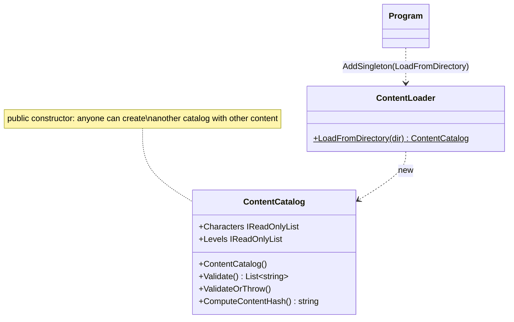
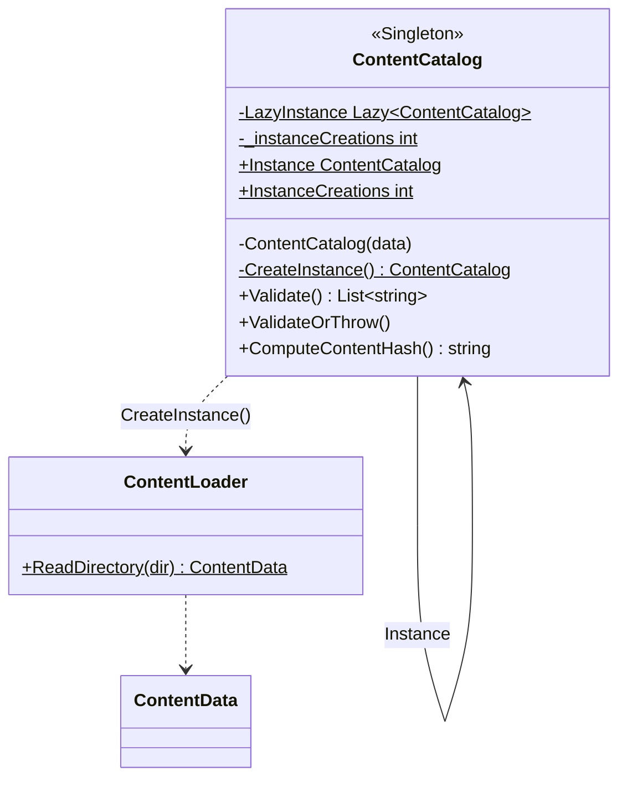

# Singleton — `ContentCatalog`

**Owner:** Student C · **Category:** Creational · **Code:** `src/CastleEscape.Game/Content/ContentCatalog.cs`
**Demo:** `dotnet run --project src/CastleEscape.PatternDemos -- singleton --threads 64` · `POST /api/patterns/singleton/demo?threads=64&naive=true`

## Problem in this game

All game content (characters, items, combos, obstacles, zombie types, 10 levels) is read from
`content/*.json`. Every session, the level generator, the zombie AI and the Content endpoints
need it. It must be:
- loaded and validated **once**;
- **the same object everywhere**, so content can't differ between sessions or endpoints;
- **safe to reach from many threads**: the game loop, request threads and hub threads all read it at once.

## Why Singleton

The catalog is one read-only thing for the whole process, and the class itself should guarantee
that. Nobody should be able to make a second catalog by accident, with a different or
unvalidated content set.

**Why still register it in DI?** `builder.Services.AddSingleton(_ => ContentCatalog.Instance)`
lets endpoints receive it as a parameter. The *lifetime* stays owned by the class, not by the
container. That is why the console demo and the unit tests can use `ContentCatalog.Instance`
without any container at all. A DI singleton alone would not stop `new ContentCatalog()`.

## Participants

| Role | Class | Notes |
|---|---|---|
| Singleton | `ContentCatalog` | private constructor, `static Instance`, `Lazy<T>` with `ExecutionAndPublication` |
| (demo only) | `NaiveCatalogHolder` | the classic unsafe `if (_instance == null) _instance = new …` for comparison |

## Before (tag `p1-prototype-before-patterns`)



## After



## Key code

```csharp
private static readonly Lazy<ContentCatalog> LazyInstance =
    new(CreateInstance, LazyThreadSafetyMode.ExecutionAndPublication);

public static ContentCatalog Instance => LazyInstance.Value;

private ContentCatalog(ContentData data) { ... }   // nobody else can construct one
```

`ExecutionAndPublication` means that if many threads read `Instance` together, **exactly one**
runs `CreateInstance`. The others wait and then all get the same object. There is no hand-written
double-checked locking to get wrong.

## Requirement: "show that it is thread-safe"

`SingletonDemo` starts N real threads (default 64). Each waits at a `Barrier`, so all read
`Instance` at the same moment. It reports:
- distinct instances seen, by `RuntimeHelpers.GetHashCode` (identity): **1**;
- `ContentCatalog.InstanceCreations`: **1**.

The same race against `NaiveCatalogHolder` (no lock, 20 ms constructor) typically shows **N
distinct instances and N constructor calls**. That is the bug the pattern avoids.
Tests: `tests/CastleEscape.Game.Tests/Patterns/SingletonTests.cs`.

## Likely live-change requests

| Request | Where to edit |
|---|---|
| "Make it eager instead of lazy" | Replace the `Lazy` with `public static ContentCatalog Instance { get; } = CreateInstance();`. Thread safety then comes from the CLR's type initializer. |
| "Show double-checked locking" | In `NaiveCatalogHolder.Instance`: `if (_instance == null) { lock (Gate) { if (_instance == null) _instance = new(); } }`. Rerun the demo: 1 instance. |
| "Break it on purpose" | Use `LazyThreadSafetyMode.PublicationOnly`. Several threads may run the factory and `InstanceCreations` > 1, but only one result is published. Explain the difference. |
| "Add a new content type" | Add a list to `ContentData`, `ContentCatalog` (property + constructor), `ContentLoader.ReadDirectory`, plus a JSON file. |
