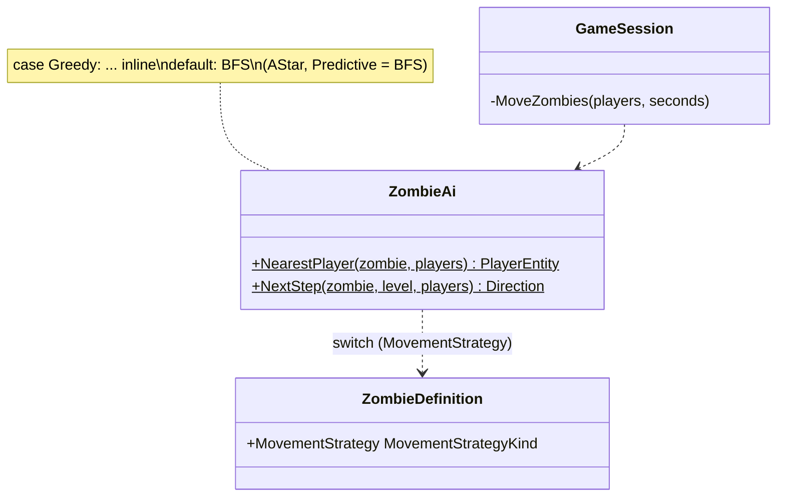
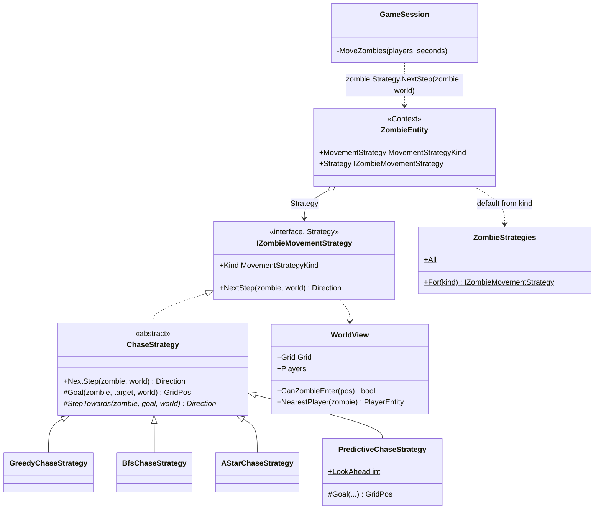

# Strategy — zombie chase algorithms

**Owner:** Student B · **Category:** Behavioral · **Code:** `src/CastleEscape.Game/AI/` (`IZombieMovementStrategy`, `ChaseStrategies.cs`), `World/PathFinder.cs` (`AStar`)
**Demo:** `dotnet run --project src/CastleEscape.PatternDemos -- strategy` · `POST /api/patterns/strategy/demo?strategy=all&steps=12`
**Used by:** `GameSession.MoveZombies` (every zombie, every tile). `StateUpdated` messages carry each zombie's current `strategy`.
**Switch:** `movementStrategy` per zombie type in `content/zombies.json`; at runtime `zombie.Strategy = …` (the Phase 5 dev endpoint `PUT /api/dev/sessions/{id}/zombies/strategy`).

## Problem in this game

ZMB-1: zombies chase the nearest player. *How* they chase is what makes zombie types and levels
feel different: a shambler that walks straight at you and gets stuck on walls, a hunter that finds
the way around, a stalker that cuts you off. In the prototype, `ZombieAi.NextStep` had a `switch`
on the zombie type's strategy kind with the Greedy code inline and "BFS for everything else". A* and
Predictive were just labels. Each new behaviour made the switch longer, and a zombie's behaviour could
not change while it was alive.

## Why Strategy

These are interchangeable algorithms for the same job, "next step for this zombie". Strategy puts
each one in its own class behind one interface. The zombie holds a reference to its strategy, and the
game loop calls `zombie.Strategy.NextStep(zombie, world)` without knowing which one it is. Adding an
algorithm is one class, and swapping it at runtime is one assignment. Strategies are stateless, so
one instance per kind is shared by all zombies (`ZombieStrategies.For(kind)`).

## Participants

| Role | Class |
|---|---|
| Strategy | `IZombieMovementStrategy` (`Kind`, `NextStep(zombie, world)`) |
| ConcreteStrategy | `GreedyChaseStrategy`, `BfsChaseStrategy`, `AStarChaseStrategy`, `PredictiveChaseStrategy` |
| Context | `ZombieEntity` (`Strategy` property, set from its type, or from its theme for `CryptZombie`) |
| Data the strategies see | `WorldView` (grid, players, `CanZombieEnter`, `NearestPlayer`), read-only |
| Client | `GameSession.MoveZombies` |

`ChaseStrategy` is a small abstract base for the shared steps: find the nearest player, pick a goal,
step towards it. Predictive overrides the goal; the others only the step.

| Strategy | Goal | Step | Behaviour |
|---|---|---|---|
| Greedy | player's tile | neighbour that most reduces Manhattan distance | fast; stuck behind walls |
| BFS | player's tile | first step of a breadth-first shortest path | never stuck; searches in all directions |
| A* | player's tile | first step of an A* path (Manhattan heuristic) | same length as BFS, fewer tiles searched |
| Predictive | up to 3 tiles ahead of a moving player | A* path to that tile | cuts players off |

## Before (tag `p1-prototype-before-patterns`)



## After



## Key code

```csharp
var direction = zombie.Strategy.NextStep(zombie, world);     // GameSession: the same line for every strategy

public IZombieMovementStrategy Strategy                     // ZombieEntity
{
    get => _strategy ??= ZombieStrategies.For(MovementStrategy);
    set => _strategy = value;                                // runtime swap
}

protected override GridPos Goal(ZombieEntity zombie, PlayerEntity target, WorldView world)   // Predictive
{
    if (target.NextTile is not { } next) return target.Tile;
    var goal = next;
    for (var i = 1; i < LookAhead && world.CanZombieEnter(goal.Step(target.Facing)); i++) goal = goal.Step(target.Facing);
    return goal == zombie.Tile ? target.Tile : goal;
}
```

## Requirement: "at least 4 strategy classes"

Four classes, one per `MovementStrategyKind`. The demo puts the same zombie behind a wall and
runs each strategy:

```text
GreedyChaseStrategy       5 steps: (1,1) (1,2) ... (5,2) -> 3 tiles from the player   (stuck at the wall)
BfsChaseStrategy         12 steps: (1,1) (1,2) (1,3) (1,4) ... (8,2) -> 0 tiles from the player
AStarChaseStrategy       12 steps: (1,1) (1,2) (2,2) ... (8,2) -> 0 tiles from the player
PredictiveChaseStrategy  12 steps: ... (8,5) (8,4) -> heads below the player, where she is walking
Search cost for the same route: BFS expanded 33 tiles, A* 20
```

`StrategyTests` checks the same: Greedy stops behind the wall, the others arrive. A* is as short
as BFS but searches less. Predictive steps towards the predicted tile. The strategy starts from the
zombie type and can be swapped.

## Likely live-change requests

| Request | Where to edit |
|---|---|
| "Add a fifth strategy (e.g. random wander, or flee)" | `MovementStrategyKind` value; a class deriving `ChaseStrategy` (or implementing the interface directly); add to `ZombieStrategies.All`. Nothing else changes. |
| "Make shamblers smarter" | Data: `movementStrategy` in `content/zombies.json`. |
| "Switch every zombie to A* now" | Runtime: set `zombie.Strategy` (the Phase 5 dev endpoint does this for a session). |
| "Predict further ahead" | `PredictiveChaseStrategy.LookAhead`. |
| "Nearest by path instead of straight line (D16)" | `WorldView.NearestPlayer`, shared by all strategies. |
| "Strategy vs State?" | Here the zombie does not change its own behaviour based on its state; the algorithm is chosen from outside (content, theme, dev tools). If a zombie switched itself (e.g. Wander → Chase when it sees a player), that would be State. |
| "Strategy vs Bridge?" | Strategy swaps one algorithm used by one context. Bridge ([Bridge.md](Bridge.md)) splits a whole abstraction hierarchy (notifiers) from an implementation hierarchy (channels), so both can grow independently. |
